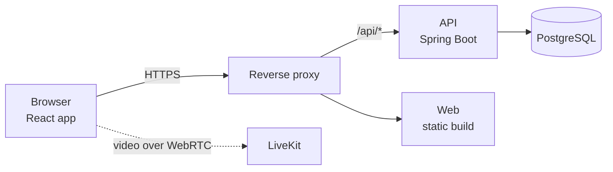

# Xovê

A private room where invited friends share their screens and cameras and watch each other live: up to 6 streams at once, 20 people in the room, with a queue when it's full. Live at [xove.app](https://xove.app), by invitation.

<p align="center">
  
  &nbsp;
  
</p>

## What it does

- **Share a screen, a window or a tab**, with its sound, and a camera on top of it or on its own. Never a microphone: voice happens wherever the group already talks.
- **Watch in theater mode:** the picked stream fills the stage in its own shape, with ambilight around it; the others play silently as previews.
- **On a phone,** as an installed home-screen app: the stage on top and a feed upright, full screen with a row of streams sideways, swipes to change who's on the stage.
- **Invited only:** sign in with Google, ask for access, an admin approves.

## How it's built

| Part | Tech |
| --- | --- |
| API ([`api/`](api)) | Java 21, Spring Boot 4 (Web MVC, Security, Data JPA), PostgreSQL 17 with Flyway, server-side sessions (Spring Session JDBC), Google sign-in |
| Web ([`web/`](web)) | React 19, TypeScript, Vite, CSS modules, `livekit-client` |
| Video | A self-hosted [LiveKit](https://livekit.io) server (a WebRTC SFU): each stream is uploaded once and forwarded to every viewer |
| Delivery | GitHub Actions: build the images, start the stack and check it's healthy, unit tests, Trivy and Semgrep, publish to GHCR, deploy to staging on every merge and to production on a version tag, with automatic rollback |



More in [docs/architecture.md](docs/architecture.md), the endpoints in [docs/api.md](docs/api.md), and the whole look (the mark, colours, type, controls, every screen) in the [design sheet](docs/design.md).

## Run it and test it

```bash
cd web && npm install && npm run dev      # the web app on its own
cd api && ./mvnw spring-boot:run          # the API (needs its settings, see Getting started)
docker compose up                         # the whole stack

cd api && ./mvnw test                     # JUnit, MockMvc, Testcontainers (needs Docker)
cd web && npm test && npm run build       # Vitest + Testing Library, then a type-checked build
```

Details in [Getting started](docs/getting-started.md) and [Testing](docs/testing.md).

## How changes are made

Every change starts as a written spec with numbered requirements and acceptance criteria, then a plan and small tasks; the pull request proves each criterion with tests, and the pipeline checks every commit. See [CONTRIBUTING.md](CONTRIBUTING.md). The specs, decisions and operations notes are kept in a private workspace; the history and the pull requests here show the result.
