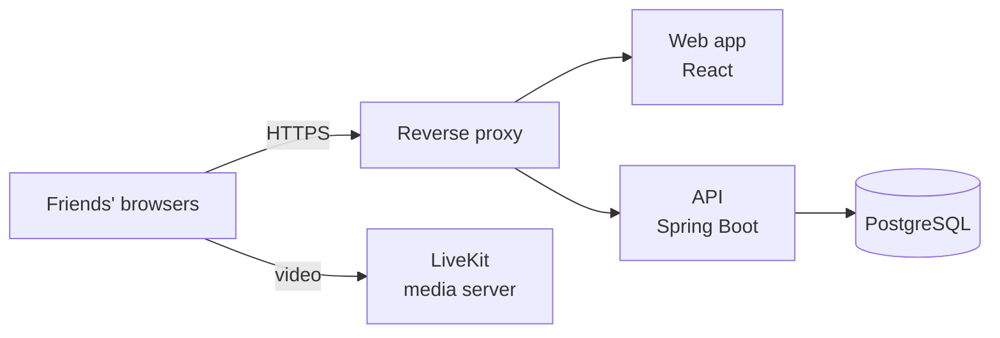

# Xovê documentation

Xovê is a private web app where one person shares their screen and a small group of invited friends watches it live. This folder is the project's wiki: what Xovê is, how it's built, how to run and test it, and how code gets from a pull request to a running server.

| Page | Read it when you want to… |
| --- | --- |
| [Overview](overview.md) | Understand what Xovê does, who it's for, and what it deliberately doesn't do |
| [Architecture](architecture.md) | See the components, how a screen share flows, the data model and the security model |
| [Getting started](getting-started.md) | Run the API and the web app on your machine |
| [Testing](testing.md) | Know what's tested, where, and how to run it |
| [Pipeline](pipeline.md) | Understand every stage of CI/CD and what happens when one fails |
| [Deployment](deployment.md) | Learn how environments, releases and rollbacks work |
| [Operations](operations.md) | Check health, read logs, handle common problems |
| [Contributing](contributing.md) | Follow the spec-first flow and the branch, commit and pull request conventions |
| [Specs](../specs/README.md) | See how a change goes from issue to spec to pull request, and the project board |
| [Decisions](decisions.md) | Find out why things are the way they are |

## At a glance

- **Web:** React 19 + TypeScript, built with Vite, served by Caddy (built from source)
- **API:** Java 21 + Spring Boot 4, PostgreSQL 17 with Flyway migrations
- **Video:** a self-hosted LiveKit server (WebRTC SFU)
- **Delivery:** GitHub Actions builds, validates, scans and publishes Docker images; servers run them with Docker Compose

## What this wiki leaves out

Hostnames of servers, IP addresses, SSH details, account names and every secret value. Those live in 1Password and on the servers themselves. Variable *names* are documented so you know what to set, never their values.
