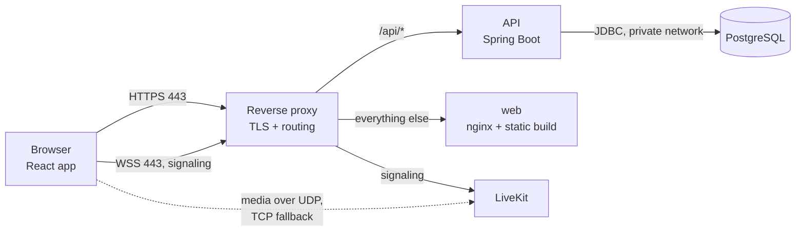
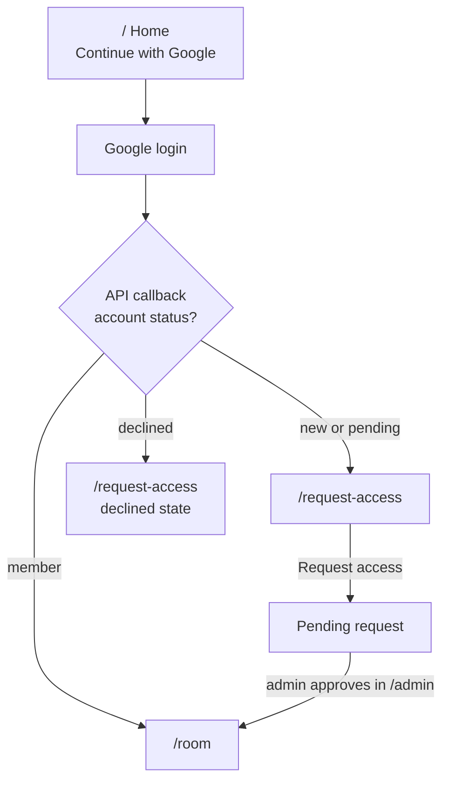
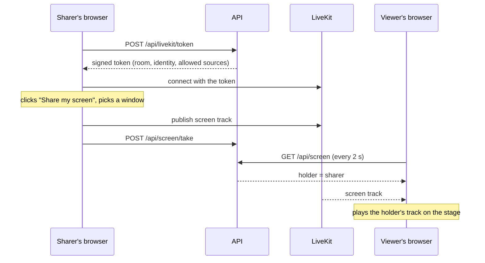

# Architecture

## Components



| Component | What it does | Tech |
| --- | --- | --- |
| **web** | The single-page app: home, request access, room, admin | React 19, TypeScript, Vite, React Router, CSS modules, `livekit-client`; served by nginx |
| **api** | Login, sessions, access requests, admin actions, the screen slot, LiveKit tokens | Java 21, Spring Boot 4 (Web MVC, Security, Data JPA, Actuator), Maven |
| **db** | Users, access requests, sessions | PostgreSQL 17, schema managed by Flyway |
| **livekit** | Receives each shared screen once and forwards it to every viewer | LiveKit server (a WebRTC SFU) |
| **reverse proxy** | HTTPS certificates, routing by hostname and path | Caddy, shared by every app on the server; configured in a separate private repository |

The database is only reachable by the API, on a private Docker network. Only the proxy and LiveKit's media ports face the internet.

**Signaling vs media.** Joining the room, knowing who's there and which tracks exist happens over a WebSocket that goes through the proxy. The video itself travels over UDP straight to LiveKit (with a TCP fallback for networks that block UDP). The API never touches media.

## Repository layout

```
api/                  Spring Boot application
  src/main/java/dev/hbrauveres/xove/
    access/           access requests and member management
    admin/            admin endpoints
    auth/             login success handling, /api/me, the current user
    config/           security and application settings
    livekit/          LiveKit token issuing
    screen/           the screen slot
    user/             users
  src/main/resources/db/migration/   Flyway migrations (V1, V2, …)
web/                  React application
  src/api/            HTTP client and API types
  src/auth/           session state and route guards
  src/hooks/          useScreenSlot, useLiveKitRoom, useRoomSession
  src/components/     UI components grouped by area (stage, controls, …), each with its CSS module
  src/pages/          Home, RequestAccess, Room, Admin
  src/test/           test helpers: fake API, fake LiveKit
livekit/livekit.yaml  LiveKit server configuration (no secrets)
ops/                  deploy and health check scripts
compose.yaml          how the services run together
.github/workflows/    commit checks (ci.yml), stage release (stage.yml)
docs/                 this wiki
```

## Who gets in



| Route | Who sees it | What it shows |
| --- | --- | --- |
| `/` | Signed out | What Xovê is, "Continue with Google" |
| `/request-access` | Signed in, not a member | "You need access", optional message, request button; a pending state that checks every 20 s and moves you in when approved; a declined state that allows asking again |
| `/room` | Members | Stage, share controls, people, activity feed |
| `/admin` | Admins | Pending requests (approve, decline), members (remove) |

Every sign-in gets a session, even for non-members; it just can't reach member-only endpoints.

## Sharing a screen

The API owns **who** is sharing (the screen slot). LiveKit carries **what** is shared (the video).



The rules the room follows:

1. **Share:** the browser's picker opens first (browsers only allow that straight from a click), then the slot is taken. Closing the picker does nothing.
2. **Take over:** after a confirmation, the slot moves to you. The previous sharer's browser notices it's no longer the holder and stops sending.
3. **Stop:** the Stop button or the browser's own bar stops the video and releases the slot. Only the holder can release it.
4. **Reload while sharing:** the page sees it holds the slot but sends nothing, and releases it.
5. **Everyone else** polls the slot every 2 seconds and plays the holder's screen track from LiveKit. The sharer sees a notice instead of their own screen.

The slot lives in the API's memory: one API instance, a handful of people, nothing worth persisting. A restart frees it.

**Known limitation:** if a sharer closes the tab or loses connection, nothing releases the slot until someone takes over. The planned fix is LiveKit webhooks telling the API when a participant leaves.

## Data model

| Table | Columns |
| --- | --- |
| `users` | id, email (unique, lowercase), name, avatar_url, google_subject (unique), status (`NONE`, `PENDING`, `MEMBER`, `DECLINED`), created_at |
| `access_requests` | id, user_id, message (≤ 500 characters), status (`PENDING`, `APPROVED`, `DECLINED`), created_at, decided_at, decided_by; at most one pending request per user |
| `spring_session`, `spring_session_attributes` | Server-side sessions (Spring Session JDBC) |

Every schema change is a new Flyway migration. A migration that already ran is never edited.

## API

| Method + path | Who | Does |
| --- | --- | --- |
| `GET /api/health` | Anyone | Liveness |
| `GET /api/oauth2/authorization/google` | Anyone | Starts Google login |
| `GET /api/login/oauth2/code/google` | Anyone | Google callback; redirects to `/room` or `/request-access` |
| `POST /api/auth/logout` | Signed in | Ends the session |
| `GET /api/me` | Signed in | `{ email, name, avatarUrl, status, admin }` and the CSRF cookie |
| `POST /api/access-requests` | Signed in, not a member | Creates a request with an optional message |
| `GET /api/admin/access-requests` | Admin | Pending requests |
| `POST /api/admin/access-requests/{id}/approve` | Admin | Makes the user a member |
| `POST /api/admin/access-requests/{id}/decline` | Admin | Declines; the user can ask again |
| `GET /api/admin/members` | Admin | Members |
| `DELETE /api/admin/members/{id}` | Admin | Removes a member and ends all their sessions |
| `GET /api/screen` | Member | `{ holder: { userId, name, avatarUrl, since } or null, mine }` |
| `POST /api/screen/take` | Member | Takes the slot (takes over if someone holds it) |
| `POST /api/screen/release` | Member | Frees the slot; 409 if it isn't yours |
| `POST /api/livekit/token` | Member | `{ url, room, identity, token }` to join the video room |

Errors follow RFC 9457 (problem details); the web app shows their `detail` field.

## Security model

- **Authentication:** Google sign-in through Spring Security (state, PKCE and session fixation handled by the framework). Accounts whose Google email isn't verified are turned away.
- **Sessions:** stored server-side in PostgreSQL, so removing a member can end their sessions immediately. The cookie is `HttpOnly`, `Secure` and `SameSite=Lax`.
- **CSRF:** every state-changing request carries a token read from a cookie and echoed in a header.
- **Authorization:** member and admin checks happen on the server for every request. The API never trusts an id sent by the browser.
- **LiveKit tokens:** signed by the API with a secret LiveKit shares. A token names one room and one identity, allows publishing only screen and screen audio (never camera or microphone), and expires after one hour. The secret never reaches the browser.
- **Network:** the database has no public port. Containers don't publish ports except LiveKit's media ports; everything else goes through the proxy.
- **Supply chain:** every change passes a vulnerability scan of the images and dependencies and a static analysis of the code before it can be published (see [Pipeline](pipeline.md)).

**Trust boundary to know about:** any member's token may publish a screen; the one-sharer rule is enforced by the web app. That's acceptable for a small group of friends. Server-side enforcement (granting publish rights only to the slot holder) is on the roadmap.
