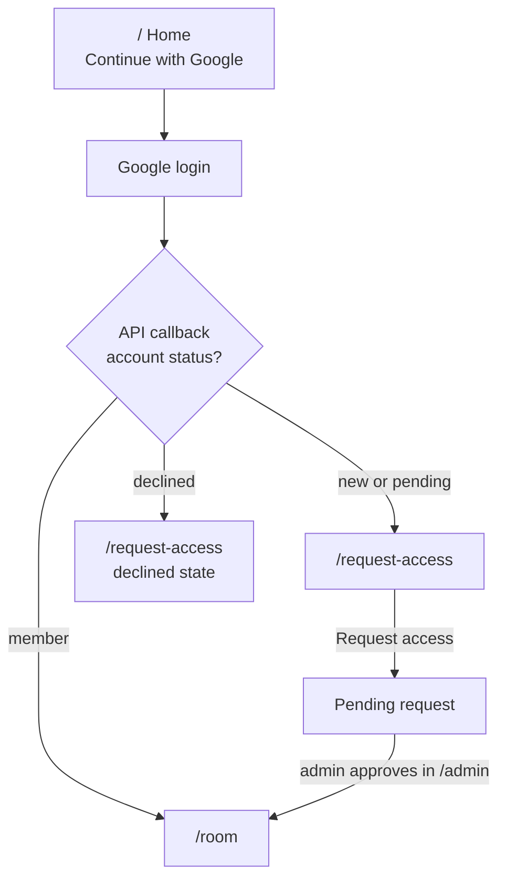
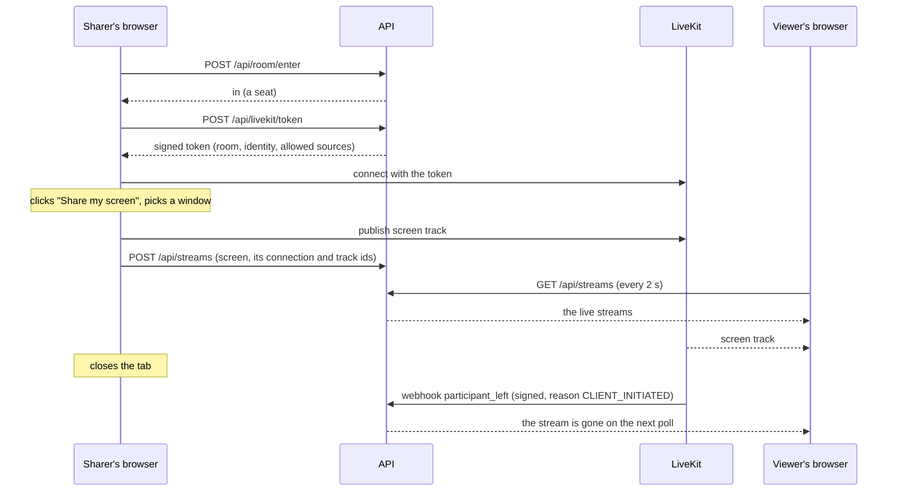

# Architecture

## Components


| Component | What it does | Tech |
| --- | --- | --- |
| **web** | The single-page app: home, request access, room, admin | React 19, TypeScript, Vite, React Router, CSS modules, `livekit-client`; served by Caddy built from source on the latest Go, running as a non-root user |
| **api** | Login, sessions, access requests, admin actions, the room's seats and live streams, LiveKit tokens | Java 21, Spring Boot 4 (Web MVC, Security, Data JPA, Actuator), Maven |
| **db** | Users, access requests, sessions | PostgreSQL 17, schema managed by Flyway |
| **livekit** | Receives each screen and camera once and forwards it to every viewer | LiveKit server (a WebRTC SFU), one per environment, run from the `infra` repo; each environment has its own room (staging `xove-stage`, production `xove`) |
| **reverse proxy** | HTTPS certificates, routing by hostname and path | Caddy, shared by every app on the server; configured in a separate private repository |

The database is only reachable by the API, on a private Docker network. Only the proxy and LiveKit's media ports face the internet.

**Signaling vs media.** Joining the room, knowing who's there and which tracks exist happens over a WebSocket that goes through the proxy. The video itself travels over UDP straight to LiveKit (with a TCP fallback for networks that block UDP). The API never touches media.

## Repository layout

```
api/                  Spring Boot application
  src/main/java/dev/hbrauveres/xove/
    access/           access requests and member management
    admin/            admin endpoints
    auth/             login success handling, /api/me, the current user
    config/           security and application settings
    livekit/          LiveKit token issuing
    room/             the room's seats and the queue
    stream/           the live streams (screens and cameras)
    user/             users
  src/main/resources/db/migration/   Flyway migrations (V1, V2, …)
web/                  React application
  src/api/            HTTP client and API types
  src/auth/           session state and route guards
  src/hooks/          useRoomSeat, useStreams, useLiveKitRoom, useRoomSession
  src/media/          how screens and cameras are sent (presets, modes, sound), who is big, remembered choices
  src/components/     UI components grouped by area (stage, controls, …), each with its CSS module
  src/pages/          Home, RequestAccess, Room, Admin
  src/test/           test helpers: fake API, fake LiveKit
compose.yaml          how the app's services run together (web, api, db); LiveKit runs from the infra repo
.github/workflows/    commit checks (ci.yml), stage release (stage.yml)
docs/                 this wiki
```

## Who gets in



| Route | Who sees it | What it shows |
| --- | --- | --- |
| `/` | Signed out | What Xovê is, "Continue with Google" |
| `/request-access` | Signed in, not a member | "You need access", optional message, request button; a pending state that checks every 20 s and moves you in when approved; a declined state that allows asking again |
| `/room` | Members | Stage (with my screen and camera buttons), people, activity feed |
| `/admin` | Admins | Pending requests (approve, decline), members (remove) |

On a phone or tablet (touch first) in a browser tab, every route shows the install screen instead ([spec 0171](../specs/0171-home-screen-app/spec.md)): Xovê is used from the home screen there, so sign-in happens inside the app.

Every sign-in gets a session, even for non-members; it just can't reach member-only endpoints.

## Sharing screens and cameras

The API owns **who** is in the room and **which streams** are live ([spec 0060](../specs/0060-several-streams/spec.md)). LiveKit carries the video.



### Seats and the queue

- **20 seats,** sharers included. The number is a setting, `XOVE_ROOM_SEATS` (1 to 20, 20 when not set); staging uses 3 to try the queue.
- **Only someone with a seat gets a LiveKit token,** so the room can't go past the seats.
- **Entering:** the room page asks for a seat (`POST /api/room/enter`). With one free and nobody waiting, you're in. Otherwise the waiting screen shows your place, and asks again every 2 seconds (that poll is how the API knows you're still there).
- **A free seat is offered** to the first in the queue: a popup with "Enter room" and "Cancel", and 60 seconds to answer (the tab's title says "Your turn"). The seat is held for them meanwhile. "Cancel" leaves the queue; no answer moves them to the end, and the next person gets the popup.
- **Leaving keeps your place for a while:**

  | You were | How you left | How the API knows | Kept for |
  | --- | --- | --- | --- |
  | In the room | closed the tab | LiveKit's `participant_left`, reason `CLIENT_INITIATED` | 30 s |
  | In the room | connection dropped | `participant_left`, any other reason | 60 s |
  | In the queue | closed the tab | `POST /api/room/leave`, sent with `keepalive` while the page closes | 30 s |
  | In the queue | connection dropped | no poll | 90 s after the last poll: Chrome lets a tab in the background poll only about once a minute |

  A dropped connection takes longer in total: LiveKit first waits for the browser to come back (about 20 to 30 seconds), and only then reports the leave.
- **A seat never used** (a token handed out, nobody joined LiveKit) is given up after 60 seconds.
- Nothing runs on a timer: whatever has run out is tidied away each time someone asks, by the clock.

### Streams

1. **Up to 6 live streams,** each a person's screen or camera. Someone with both uses 2. Nobody is pushed out: with 6 live, the start buttons wait.
2. **Share or turn on the camera** with the round buttons over the bottom of the stage ([spec 0098](../specs/0098-player-buttons/spec.md)): one centred row of volume, screen, camera and settings ([spec 0101](../specs/0101-player-polish/spec.md)), volume and settings only while watching someone else. They fade with the player's labels over a stream, stay while focused or while a menu or the volume slider is open, and come along in fullscreen. In fullscreen, the setup window and any error from starting are drawn over the player. A full room greys them out, with the reason in their tooltip; a phone that can't share a screen shows only the camera button. The browser's picker (or camera prompt) opens first; Chrome is asked to stay on Xovê after the pick (`CaptureController.setFocusBehavior`), then a setup window shows a preview and the settings. Nothing is sent until its "Start" button. Closing the picker does nothing. The camera is asked for only on that click, never with the microphone.
3. **While live,** the arrow on a stream's button opens its menu: quality and mode (below), then:
   - **Change window** opens the picker again and swaps the new pick into the same LiveKit track (`replaceTrack`): no setup window, no new stream for the API or viewers. The sound follows: swapped, added as a new sound track, or removed.
   - **A camera list** switches the camera being sent (`restartTrack` on the same track); the pick is saved in the browser (`xove.camera.device`).
4. **Stop:** the lit button, the menu's Stop, or the browser's own bar stops the video and ends the stream. Only its person can stop or change a stream.
5. **Reload while sharing:** the page sees the API lists a stream of its own that nothing sends, and ends it.
6. **Everyone** polls the streams every 2 seconds and plays them from LiveKit. People sharing see their own streams, as viewers do, without their sound.
7. **A sharer leaves** (closes the tab, loses connection, crashes): LiveKit sends the API a signed webhook, and the API ends all of that person's streams at once, so nobody watches a frozen picture; their seat is kept as above. A stopped track ends just that stream. Only one connection per person: opening the room on a second device disconnects the first. Specs: [`0038`](../specs/0038-stale-slot/spec.md), [`0060`](../specs/0060-several-streams/spec.md).

### Watching

- **The page** ([spec 0104](../specs/0104-room-theater/spec.md), the look in [its design](../specs/0104-room-theater/design.html)) is theater mode:
  - **Header and footer:** full width and see-through. The header holds the logo, the activity pill, the people button and the account button (connection dot; name, role and connection, ambilight, Admin, Sign out). The footer is plain text.
  - **The middle:** a size container. Its one column is the 16:9 box: as big as the window allows at 16:9, and the info row under it is exactly that wide.
  - **The stage hugs the picture** ([spec 0107](../specs/0107-stage-hug/spec.md), [its design](../specs/0107-stage-hug/design.html)):
    - `useVideoShape` reads the big video's width ÷ height, following its `resize` event and ignoring changes under 1%;
    - the stage's box sizes itself from it in container units, inside the 16:9 box: a wider picture keeps the full width and gets shorter, a taller one keeps the full height and gets narrower, centred. No black bars.
    - Empty and loading stages are 16:9; fullscreen keeps its bars.
  - **Dropdowns** (`components/ui/Dropdown.tsx`): frosted sections with 2 px clear cuts. They unroll by their height, since a clip or fade would stop the blur. One opens at a time.
- **Ambilight** (`media/ambilight.ts`, `stage/Ambilight.tsx`, [spec 0118](../specs/0118-ambilight-smooth/spec.md)): drawn by the browser's graphics pipeline, with no pixel reads.
  - **The canvas:** a grid of square cells round the stage follows its shape (`gridFor`): 64×36 at 16:9, 36×64 for a portrait picture, at most 96 along the longer side. On it, the glow reaches 16 cells, then a 3-cell margin, at 2 px a cell (`glowLayout`).
  - **Each update:**
    - draws the picture in nine pieces (`edgeDraws`): the whole picture under the stage, its edge strips stretched outward, and its corner patches stretched into the corners;
    - draws them over the last update at partial opacity: the easing, with a 120 ms time constant (`easeFor`);
    - blurs the result once and cuts it with a fade mask (`fadeMask`), made once per grid: the falloff to exactly zero before the margin, plus a fixed grain against bands.

    The page only stretches the canvas, so a 4K monitor costs the same.
  - **Timing:** it updates with the screen's refresh (`requestAnimationFrame`, at most 60 a second), every 500 ms with reduced motion, and only while the tab is visible, the video plays and it's on.
  - **Unreadable streams:** it reads no pixels, so a stream the page can't read is lit too.
  - **Nobody live** ([spec 0158](../specs/0158-phone-upright/spec.md)): the empty stage's colour bars, at full colour, are lit too. They're a small still picture (`barsPicture()`), drawn once, with no loop.
  - **Settings:** on and brightness are saved in the browser (`xove.ambilight.*`).
- **Each viewer picks who is big:** a preview, or a live stream's event in the activity list (a camera event shows the camera big). By default, and when the big person stops, it's the person sharing the longest (`web/src/media/stagePick.ts`). The choice is kept by the room (`useStagePick`).
- **Who watches what:** each browser reports what's on its stage (`PUT /api/streams/watching`), once it has been still for a second, and again when a poll shows the API lost it. The streams poll returns everyone's, for the people panel.
- **The info row** (spec 0107): both sides centred on one line.
  - **Left:** who is on the stage (the avatar's ring drawn inside it, a filled LIVE badge, what, how long), and who's watching: up to 4 avatars and "N watching", me included, never the sharer.
  - **Empty stage:** "The stage is yours." with who's here.
  - **Right:** the other streams as previews, then a dashed box with "N of 6 live" and the places left, gone when all 6 are live. A preview shows their screen, or their camera when that's all they share.
  - **When room runs short:** the left gives way first, then the previews scroll with a slim scrollbar, and the box stays put.
- **The facecam:** when the big person shares their screen and their camera, the screen is big and the camera is a small window over it. Its "Swap views" button (two arrows) swaps them, also on your own preview. It can be dragged anywhere over the player (or moved with the arrow keys), and collapsed to a tab. Each browser keeps these choices for the visit only.
- **On a phone or tablet** (specs [0158](../specs/0158-phone-upright/spec.md) and [0160](../specs/0160-phone-sideways/spec.md), [the design](../specs/0160-phone-sideways/design.html)):
  - **Which layout** (`useRoomLayout`, `layoutFor`):

    | Device | Upright | Sideways |
    | --- | --- | --- |
    | Phone: touch first (`pointer: coarse`), shorter side ≤ 500 px | upright view | sideways view |
    | Tablet: touch first, larger | upright view | desktop layout |
    | Anything else | upright view if the window is ≤ 760 px wide and upright | desktop layout |

    Turning switches layouts at once; the stage keeps its place in the page, so the video and a share go on.
  - **Upright:**
  - **The top bar:** the wordmark; then, by use, the people button, a bell (`ActivityBell`: the activity list, with no count or dot) and my account at the far right. No footer: its items end the account menu.
  - **The stage:** still one screen, with the stage edge to edge under the top bar, hugging the picture but never taller than 60% of the screen. Its info row is the compact `NowWatching`: "Name · what", then LIVE, the time and "N watching".
  - **Under it, the only part that scrolls:** "Live now · N of 6" and the other streams as a feed (`LiveFeed`: full-width pictures, then the same info row; silent, so their sound isn't downloaded; a tap puts one on the stage). With nobody live, "Nobody live · 0 of 6 · 6 free" and who's here as cards (`HereCards`), with how long each has been here, from the API's `here`.
  - **Swiping the stage** ([spec 0159](../specs/0159-swipe-stage/spec.md)): left for the next person live, right for the previous, in the feed's order and wrapping around (`stepOnStage`). The picture follows the finger and slides (`useStageSwipe`); a drag under a quarter of the width, unless it's a quick flick, springs back; reduced motion changes at once. Drags that start on the round buttons, the facecam or the fullscreen button (`data-no-swipe`) are theirs. Dots above the buttons (`StageDots`), upright and sideways, show who's on the stage and jump on a tap; they fade with the buttons, and there are none with one person live.
  - **Sound on a phone:** phones block sound that starts without a tap on the page, so the first tap or key in the room unlocks it (`room.startAudio()`), and LiveKit plays what was silent.
  - **Only from the home screen** ([spec 0171](../specs/0171-home-screen-app/spec.md), [its design](../specs/0171-home-screen-app/design.html)): in a browser tab, a touch device sees only `InstallPage`. It tells the home-screen app by the display mode (`useInstalled`: `display-mode` fullscreen or standalone, or `navigator.standalone`). On Android, "Get Xovê" opens the browser's install prompt, caught as the page loads (`install/prompt.ts`), once (a browser offers it only once), or points to the menu's "Install app" when there's none; on iPhone and iPad (`isApple`), Safari's Share steps. The manifest has what Chrome checks before offering an install (`id`, `start_url`, `scope`, a maskable icon) and `"display": "fullscreen"`, so the app opens with no browser bar.
  - **The full-screen view:** on a phone, and on a tablet held upright, the stage's fullscreen button switches to the sideways layout while the phone stays upright, and back ("Full-screen view", "Exit full-screen view"). Turning doesn't change the choice, and sideways there's no button: the room is already in that view. Desktops, and tablets held sideways (the desktop layout), keep the player's fullscreen.
  - **The setup window** on a short, wide screen shows its preview on the left and its settings on the right.
  - **Upright on a tablet:** the stage stays full width; the info row and what scrolls under it sit in a centred column, at most 640 px wide.
  - **Sideways:**
    - **The stage:** no header, logo or footer. It fills the screen height first and hugs the picture, black at its sides where the light glows.
    - **The top bar:** a black gradient across the top: who's on the stage (the compact info row, or "Nobody live · 0 of 6 · 6 free") on the left, and the people button, the bell and my account on the right.
    - **The buttons:** the round buttons at the bottom of the stage. On a phone there's no fullscreen button sideways (the room is already in the full view); it shows at the bottom right only in the upright full view.
    - **Fading:** while a stream plays, a touch anywhere shows the controls, and about 2.5 s later the top bar, the buttons and the row's arrow button fade (`data-fades`), and an open row closes. Over the empty stage nothing fades.
    - **The streams row** (`StreamsRow`): the other streams as small silent pictures with names, "Live now · N of 6", along the bottom over a black gradient. It's closed at first; a swipe up opens it (`useStageSwipe` with `axis: "vertical"`), a swipe down or the controls fading close it, and a round button at the bottom left opens it (arrow up) and, on the open row, closes it (arrow down). A tap puts that person on the stage; a left or right swipe changes the stream, as upright.
- **Sound:** the big person's plays. Previews are muted, each with its own speaker and a horizontal volume slider; a muted preview's sound isn't downloaded at all. A preview without sound has no speaker.
- **Bandwidth:** each video is downloaded at the size it's shown (adaptive stream), so previews and the facecam come in low; layers nobody watches aren't sent (dynacast). The viewer's quality menu is for the big video.

Seats and streams live in the API's memory: one API instance, a handful of people, nothing worth persisting. A restart (every deploy) empties them; each open room asks for its seat again within a poll, with its LiveKit connection (LiveKit doesn't report it joining again, so that confirms the seat), and registers what it's still sending. If the 6 places filled up meanwhile, it stops sending; any other failure is tried again on the next poll. Re-registered streams count as started then, so "longest sharing" restarts from that order.

### Video and sound quality

How a screen or a camera is sent is decided in one place, `web/src/media/shareSettings.ts` ([spec 0086](../specs/0086-stream-quality/spec.md)). LiveKit's defaults suit slides and voice calls; these suit games and videos.

- **Starting:** the browser's picker captures the screen, then a setup window shows a preview and the settings. Nothing is sent until "Start sharing".
- **Which sound** ([spec 0095](../specs/0095-app-sound/spec.md)): a picked window shares only its app's sound (Chrome's "Share this app's audio too"), a tab its own sound, and the whole screen the system sound without Xovê's own sound. Xovê opens the picker itself (`getDisplayMedia`) because livekit-client drops the `windowAudio` option, and hands the tracks to LiveKit.
- **The sharer picks a quality:** 1080p (the default), 720p or 480p, all at 30 fps. The screen is always captured at 1080p and sent in VP9 with all three layers; the chosen quality is a **cap**: the layers above it aren't sent.
  - **No tight limits:** each layer may use up to 8, 4 and 2 Mbit/s. That's above what a screen usually needs, so only the sharer's computer and connection, and each viewer's, limit the picture. The browser and LiveKit lower the bitrate by themselves when a connection can't keep up.
  - The sharer uploads all the layers (up to about 14 Mbit/s at 1080p on a great connection); each viewer downloads one.
  - The VPS's monthly traffic (8 TB) is watched in Hostinger's panel.
  - Firefox (no VP9) and Safari send a single layer: viewers then get only the sharer's quality, and the quality menu offers nothing lower. In Safari, Sharp mode also behaves like Smooth.
- **A camera** ([spec 0060](../specs/0060-several-streams/spec.md)) goes up to 720p: 720p (the default) or 480p, at 30 fps, in VP9 with a 720p and a 480p layer. It has the same modes.
- **And a mode:**
  - **Smooth** (the default): marked as motion. When the connection is tight, the picture gets softer and the frame rate holds.
  - **Sharp:** marked as detail. The picture keeps its detail and the frame rate drops.
- **Changing them mid-share,** from the stream button's menu (each stream has its own), is live: same stream, no reload.
  - The sharer's browser applies the new cap and mode right away, and tells the API (`POST /api/streams/{kind}/settings`).
  - Every viewer's app reads the settings with the streams (every 2 seconds) and follows them: its quality menu offers nothing above the cap, and Auto asks for no more than the cap.
  - Since no viewer asks for the layers above the cap, LiveKit stops sending them (dynacast), so the sharer's upload really drops.
- **Sound** is captured without the microphone filters (echo cancellation, noise suppression, automatic volume), in stereo, and sent at 128 kbit/s without silence skipping. Chrome gives sound only from a tab, or from the whole screen on Windows; Firefox and Safari give none. A screen without sound says so in its button's tooltip and menu; viewers see a crossed, locked volume button ("No sound in this stream") until it has sound.
- **Viewers** have two round buttons in the row ([spec 0101](../specs/0101-player-polish/spec.md)):
  - **Volume:** a click mutes, and unmutes back to the same volume. Pointing at it or focusing it slides a vertical slider up (a range input turned a quarter, so it's vertical in every browser). No slider while muted, without sound, or on iPhones and iPads, which ignore a page's volume.
  - **Settings** (a gear): its quality menu offers "Auto" (adaptive stream: what fits the player and the connection) or a fixed quality from the sharer's down to 480p. A fixed quality asks the server for that size, so the viewer really downloads less.
- **The LIVE label, the name and the bars** fade when the mouse stops moving over the player, and come back when it moves (or after a tap).
- **Each browser remembers** its choices in `localStorage` (`xove.share.*`, `xove.camera.*`, `xove.watch.*`).

To check a share on staging, open `chrome://webrtc-internals` in the viewer's or the sharer's browser. It shows the codec, frame rate, resolution, bitrate, and why quality drops: "cpu" means the sharer's computer can't keep up, "bandwidth" means the connection can't.

**LiveKit webhooks.** Each environment's LiveKit posts every room event to its own API (`http://xove-<env>-api:8080/api/livekit/webhook`), signed with that environment's API key (a JWT with a hash of the body). The API refuses anything whose signature doesn't check out, ignores events from any room other than its own, and only acts on `participant_joined` (the seat is used), `participant_left` (the person's streams end, the seat is kept 30 or 60 seconds by its `disconnectReason`) and `track_unpublished` (a screen or camera ends).

**Where LiveKit runs** ([spec 0044](../specs/0044-livekit-in-infra/spec.md)). One LiveKit server per environment, both defined once in the `infra` repo (`livekit/compose.yaml`) and fed by that environment's generated settings: staging at `rtc-stage.xove.app` with media on 7881/tcp and 7882/udp, production at `rtc.xove.app` with 7883/tcp and 7884/udp. Each has its own key pair, shared only with its own API, so nothing signed for one environment is accepted by the other. This app only needs `LIVEKIT_URL`, the key pair and `LIVEKIT_ROOM`.

## The look

Specs [0111](../specs/0111-brand-mark/spec.md), [0113](../specs/0113-cozy-palette/spec.md) and [0121](../specs/0121-soft-black-controls/spec.md), with the reference in [0121's design](../specs/0121-soft-black-controls/design.html) (its black palette and its Controls section).

- **The mark:** [XOVE] in a slim viewfinder, the O a record button (a white ring and a red dot), and the top-right corner red, standing in for the ^ of Xovê.
  - Its geometry lives in one place, `web/src/brand/mark.ts`.
  - `components/brand/XoveMark` draws the wordmark as inline SVG in every page's header, named "Xovê" for screen readers. `XoveIcon` draws the symbol.
- **The hover animation:** pointing at the wordmark (or focusing it) plays it once.
  - The left corners stay. The word slides left under them until the X is gone, while the right corners close in to the O. Then the corners settle into the icon, the dot double-blinks, and it all plays back.
  - The timeline is a pure function (`brand/markTimeline.ts`); `useMarkAnimation` applies it to the SVG without re-rendering.
  - Nothing plays with reduced motion.
- **The symbol by size:** `iconMark("large" | "small" | "tiny")`.
  - **Large** (64 px and up): slim, at about 70% of its square.
  - **Small** (32 px) and **tiny** (16 px): heavier strokes, filling more of the square. Tiny runs edge to edge.
  - The outer edges are the same in all three.
- **Icons:** `web/public/` holds the favicon, the phone icons and `site.webmanifest`. `index.html` links them.
  - **Favicon** (`favicon.svg`): the bare tiny symbol. Its white parts turn soft black when the browser is light (a `prefers-color-scheme` rule inside the file); the red stays.
  - **Phone icons** (`apple-touch-icon.png`, `icon-192.png`, `icon-512.png`): the large symbol on the soft black ground, since phones fill transparency with black anyway.
  - `node scripts/brand-icons.mjs` (from `web/`) rewrites the favicon from `mark.ts`, and a test fails if it drifts. `--phone` prints the SVG the PNGs are rendered from.
- **The palette** (`styles/global.css`): black, neutral greys and red, chosen over a dark blue and five greys compared on the real pages.
  - **Neutrals:** ground soft black `#0c0c0d`, panels `#161617`, raised `#1b1b1d`, lines `#2c2c2f`, text `#ebebec`, muted `#9a9a9f`, faint `#66666b`.
  - **Accent:** red, `#ef4b4b`, the same as LIVE. Text on a red fill uses `--accent-ink` `#3a0808`.
  - **Pure black only behind the video:** the stage, the previews, the facecam and the share preview keep `#000` behind the picture, its own frame, so the stage reads as a screen.
  - **Unchanged:** green and yellow stay for status, the avatars keep a colour per person, and the empty stage's colour bars keep theirs.
  - `styles/palette.test.ts` checks the tokens, rejects the old palettes, keeps pure black to the five video frames, and computes every text colour's contrast on every surface: 4.5:1, and 3:1 for faint labels.
- **The controls** (spec 0121): quiet, so red stays for the brand and what's live.
  - **Sliders:** `components/ui/Range`, a plain range input styled white like a video player's: a 3 px track, white up to the knob and `#ebebec` at 22% after, and a 12 px white knob that grows to 14 px on hover or focus. WebKit has no part for the filled side, so `Range` sets `--fill`; Firefox uses `::-moz-range-progress`. The ambilight's brightness, the stage's volume (turned a quarter) and a preview's volume all use it.
  - **The switch** (the ambilight's, in the account menu): a 36 × 14 px grey `#3a3a3d` track, the same off and on, and a 20 px knob that overhangs it, `#bdbdc0` off and red on, sliding in 180 ms.
  - **The footer:** "Buy me a coffee" is white, among muted links.
  - `styles/controls.test.ts` checks these values.

## Data model

| Table | Columns |
| --- | --- |
| `users` | id, email (unique, lowercase), name, avatar_url, google_subject (unique), status (`NONE`, `PENDING`, `MEMBER`, `DECLINED`), created_at |
| `access_requests` | id, user_id, message (≤ 500 characters), status (`PENDING`, `APPROVED`, `DECLINED`), created_at, decided_at, decided_by; at most one pending request per user |
| `spring_session`, `spring_session_attributes` | Server-side sessions (Spring Session JDBC) |

Every schema change is a new Flyway migration. A migration that already ran is never edited.

## API

| Method + path | Who | Does |
| --- | --- | --- |
| `GET /api/health` | Anyone | Liveness |
| `GET /api/oauth2/authorization/google` | Anyone | Starts Google login |
| `GET /api/login/oauth2/code/google` | Anyone | Google callback; redirects to `/room` or `/request-access` |
| `POST /api/auth/logout` | Signed in | Ends the session |
| `GET /api/me` | Signed in | `{ email, name, avatarUrl, status, admin }` and the CSRF cookie |
| `POST /api/access-requests` | Signed in, not a member | Creates a request with an optional message |
| `GET /api/admin/access-requests` | Admin | Pending requests |
| `POST /api/admin/access-requests/{id}/approve` | Admin | Makes the user a member |
| `POST /api/admin/access-requests/{id}/decline` | Admin | Declines; the user can ask again |
| `GET /api/admin/members` | Admin | Members |
| `DELETE /api/admin/members/{id}` | Admin | Removes a member and ends all their sessions |
| `POST /api/room/enter` | Member | Asks for a seat, or polls the queue: `{ status: "in" }`, `{ status: "waiting", place }` or `{ status: "offered", until, seconds }`. Optional body `{ participantSid }` from a page already in the video room: confirms its seat after an API restart |
| `POST /api/room/accept` | Member | Takes the seat offered: `{ status: "in" }`; 409 when there's no offer (it ran out) |
| `POST /api/room/cancel` | Member | Leaves the queue, or turns the offer down; 204 |
| `POST /api/room/leave` | Member | The waiting page is closing: the place is kept 30 seconds; 204 |
| `GET /api/streams` | Member | `{ streams: [{ kind, userId, name, avatarUrl, since, settings: { quality, mode }, mine }], free, seated, seats: { total, taken, waiting }, watching: [{ userId, sharerId, kind, mine }], here: [{ userId, since, mine }] }`, streams oldest first; `watching` lists seated people watching live streams (spec 0104); `here` lists everyone with a seat and when it was first given, kept through a reload (spec 0158) |
| `PUT /api/streams/watching` | Member | What's on my stage (spec 0104). Body `{ sharerId, kind }`, or `{}` for an empty stage; 204, 400 for a bad kind. Kept in memory; leaving the room forgets it |
| `POST /api/streams` | Member with a seat | Starts a stream. Body `{ kind, participantSid, trackSid, quality?, mode? }`: `screen` or `camera`, the LiveKit connection and track it comes from (never shown to anyone; 400 without them), and what it's sent with (a missing value is 1080p Smooth for a screen, 720p Smooth for a camera; a camera can't be 1080p). Starting the same kind again replaces your own. 409 when the 6 places are taken (with `reason: "full"`), or without a seat |
| `POST /api/streams/{kind}/settings` | Its person | Changes what the stream is sent with. Body `{ quality, mode }`; 400 for an unknown value, 409 if you don't have that stream |
| `POST /api/streams/{kind}/stop` | Member | Ends your stream of that kind; nothing to stop is fine |
| `POST /api/livekit/token` | Member with a seat | `{ url, room, identity, token }` to join the video room; 409 without a seat |
| `POST /api/livekit/webhook` | LiveKit (signature, no login) | Room events; marks seats used, keeps them after a leave, ends streams whose connection left or track stopped. 401 on a bad signature |

Errors follow RFC 9457 (problem details); the web app shows their `detail` field.

## Security model

- **Authentication:** Google sign-in through Spring Security (state, PKCE and session fixation handled by the framework). Accounts whose Google email isn't verified are turned away.
- **Sessions:** stored server-side in PostgreSQL, so removing a member can end their sessions immediately. The cookie is `HttpOnly`, `Secure` and `SameSite=Lax`.
- **CSRF:** every state-changing request carries a token read from a cookie and echoed in a header.
- **Authorization:** member and admin checks happen on the server for every request. The API never trusts an id sent by the browser.
- **LiveKit tokens:** signed by the API with a secret LiveKit shares. A token names one room and one identity, allows publishing only a screen, its sound and a camera (never a microphone), and expires after one hour. Only someone with a seat gets one. The secret never reaches the browser.
- **Network:** the database has no public port. The app's containers publish no ports; only the proxy (80/443) and each LiveKit's two media ports face the internet.
- **Supply chain:** every change passes a vulnerability scan of the images and dependencies and a static analysis of the code before it can be published (see [Pipeline](pipeline.md)).

**Trust boundaries to know about:** any seated member's token may publish a screen and a camera; the 6-stream limit is enforced by the web app and the API's list, not by LiveKit. And a token stays valid for an hour, so someone who lost their seat could rejoin LiveKit with an old one. And after a restart the API takes a page's word for its LiveKit connection when it asks for its seat again, so a member could keep a seat they don't use. All three are acceptable for a small group of friends.
