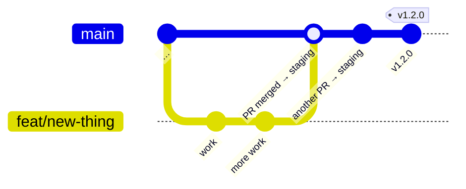

# Deployment

## Branches and releases



- **`main` is the integration branch.** Every pull request merges into it, and every merge deploys to **staging** automatically.
- **A release is a tag** (`v1.2.0`) on a commit of `main` that's been running well on staging. The tag deploys that exact build to **production** ([see below](#production-releases)). Nobody deploys production by hand.
- Feature branches are short-lived: `feat/…`, `fix/…`, `ci/…`, `docs/…`, `chore/…`.

Nobody pushes to `main` directly. A branch ruleset requires a pull request and the pipeline's required checks, and blocks force pushes and deletion.

## Environments

| | Staging | Production |
| --- | --- | --- |
| Address | `stage.xove.app` | `xove.app` |
| Receives | Every merge to `main`, automatically | Version tags (`vX.Y.Z`) only |
| Access | An extra gate in front of the app, then normal sign-in | Normal sign-in |
| Database | Its own | Its own |
| Google sign-in | Its own OAuth client | Its own OAuth client |
| LiveKit | Its own server, `rtc-stage.xove.app`, room `xove-stage` | Its own server, `rtc.xove.app`, room `xove` |
| Deploy key | Can only deploy staging | Can only deploy production |
| Search engines | Told not to index (`X-Robots-Tag: noindex`) | Normal |

Both environments run on the same server, from their published images and this repo's `compose.yaml` (no checkout of the code). Their settings are generated per environment from the `infra` repo and 1Password ([settings and secrets](operations.md#settings-and-secrets)), never written by hand or committed. Container names carry the environment (`xove-stage-api`, `xove-prod-api`), so they can run side by side. A shared reverse proxy, configured in a separate private repository, routes each hostname to its containers and handles HTTPS.

## How a deploy works

```mermaid
sequenceDiagram
  participant GH as Pipeline (stage 5)
  participant S as Server: infra/ops/deploy.sh xove stage
  participant G as GitHub (xove repo)
  participant R as Container registry
  GH->>S: SSH: deploy <commit>
  Note over S: one deploy at a time; the running version is the last one in the history
  S->>S: build stage.env from infra/config + 1Password
  S->>G: is <commit> on main? (refuse branches and forks)
  S->>G: compose.yaml of <commit>
  Note over S: check it: only xove's own images (sha-<commit>), volumes and networks, no host access; refuse versions that still start LiveKit (before spec 0044)
  S->>S: prepare the running version's compose file too (the way back)
  S->>R: pull api and web images
  S->>S: docker compose up --wait (project xove-stage)
  alt healthy
    S-->>GH: ok (logged in the history)
  else not healthy
    S->>S: previous compose file and tag, up --wait again
    S-->>GH: failed, rolled back
  end
```

Key points ([spec 0067](../specs/0067-deploy-from-infra/spec.md), decisions 25 and 26):

- **The server never builds and has no copy of the code.** It pulls the images the pipeline built, tested and scanned, and runs them with the `compose.yaml` of that same commit, downloaded from GitHub.
- **The deploy tool lives in the private `infra` repo**, so a change merged into this public repo can't change what runs on the server with deploy rights. One tool deploys any app to any environment: `ops/deploy.sh <app> <env> …`.
- **The SSH key can do one thing.** On the server, the pipeline's key is restricted to `/srv/infra/ops/deploy.sh xove stage` (a forced command), so it can't open a shell or pick another app or environment. The tool only accepts one line: `deploy <40-character commit>`, `rollback` or `status`.
- **Only merged code runs, and only as the app.** The tool deploys a commit only if it's on `main` (GitHub's API; commits on branches or forks are refused), and treats this public repo's `compose.yaml` as untrusted: it may run only xove's own images at that commit's tag (plus `postgres` for the database), with its own volumes and networks and the proxy's `web` network, and nothing that reaches the host (privileged mode, host mounts, published ports, env files…). A new kind of setting in `compose.yaml` is refused until `infra/ops/check-compose` allows it, and this repo's CI can't see that: when a pull request adds a new key to `compose.yaml` (`logging:`, `ports:`…), check it against `check-compose` before merging. `include` and `extends` aren't allowed (they'd pull in files the check never saw).
- **"Healthy" is defined here, in `compose.yaml`** (`healthcheck:` for every service). The deploy waits for it with `docker compose up --wait`, and so does the pipeline's validate stage.
- **Rollback is automatic.** If a health check fails (the API gets 90 s to start, then 5 failed checks 5 s apart mark it unhealthy) or the stack isn't healthy after 3 minutes, the tool runs the previous version's compose file and images again and reports the failure. The previous version's compose file and images are made ready before anything changes, so the way back needs neither GitHub nor the registry; the new images are pulled first too, so a registry problem refuses the deploy instead of looking like a broken version. Stage 6 of the pipeline then deletes the failed images.
- **A dropped connection doesn't stop a deploy.** The tool runs the work in its own session and only shows its log over SSH, so a cancelled pipeline run or a network cut can't leave staging halfway between versions. Every run's output stays in `/srv/infra/state/xove-<env>/logs/`. One deploy or rollback runs at a time; a second one waits up to 10 minutes.
- **State lives in `infra`, on the server:** `/srv/infra/state/xove-<env>/` keeps the deploy history, the running tag and the recent compose files. LiveKit isn't part of this deploy: it runs from `infra` too, and keeps running while the app is redeployed.

### Database migrations and rollback

Flyway runs new migrations when the API starts. A rollback puts back the old code, but **it doesn't undo migrations**. So every migration must keep working with the previous version of the code:

- Adding a table or a nullable column: safe.
- Renaming or dropping a column: do it in two releases. First release: add the new column and write to both. Second release, once the first is proven: stop using the old one and drop it.

## Deploying staging by hand

Only staging, and only when needed (production is released only from tags). On the server:

```bash
/srv/infra/ops/deploy.sh xove stage status                # what's running, recent deploys, container status
/srv/infra/ops/deploy.sh xove stage deploy <commit-sha>   # deploy a commit whose images were published
/srv/infra/ops/deploy.sh xove stage rollback              # go back to the previous deploy
```

The images for a commit exist only if its pipeline reached stage 4, and only commits on `main` deploy. Versions from before this move have no health checks for `api` and `web` in their `compose.yaml`: a rollback to one of them only waits for the containers to run, so check `/api/health` by hand afterwards.

## Setting up a server for pipeline deploys

One-time steps per environment. Values (host, user, keys) go in 1Password, not here.

1. **Infra and settings:** clone the `infra` repo into `/srv/infra` (no checkout of this repo is needed). Docker Compose must be 2.35 or newer. Install the 1Password CLI and `python3-yaml`, put the `xove-server` service account token in `~/.config/op/token` (`chmod 600`), and check the environment's settings resolve: `/srv/infra/ops/build-env <env> --check`.
2. **Registry login:** the images are private, so the server logs in to GitHub Container Registry once with a personal access token (classic) that has only `read:packages`: `docker login ghcr.io`.
3. **Deploy key:** generate a dedicated key pair. Add the public key to the deploy user's `authorized_keys` with a forced command and `restrict` (no forwarding of any kind, no terminal, no `~/.ssh/rc`):
   ```
   command="/srv/infra/ops/deploy.sh xove <env>",restrict ssh-ed25519 AAAA… github-actions-deploy
   ```
   Each environment has its own key: `deploy-ssh` for staging, `deploy-ssh-prod` for production.
4. **Pipeline secrets:** store the private key, the server's host key (`ssh-keyscan`), host, port and user in that environment's item of the `Xove CI` vault (see [Pipeline](pipeline.md#secrets-the-pipeline-uses)).
5. **First deploy:** for staging, merge anything to `main` (or run the stage release manually); for production, push a version tag. The first deploy has nothing to roll back to, so watch it.

## Production releases

Production changes only through the **Production release** pipeline ([`release.yml`](../.github/workflows/release.yml)):

1. **Pick a commit** on `main` that runs well on staging.
2. **Tag it:** `git tag v1.2.0 <commit> && git push origin v1.2.0`. Only the maintainer can create `v*` tags; the tag is the approval.
3. **The pipeline:**
   - Checks the commit's stage release was green.
   - Tags its `sha-…` images as `v1.2.0` (the same images, no rebuild).
   - Deploys them with production's key and the same tool as staging, which rolls back by itself if the new version isn't healthy.
   - Checks `https://xove.app` from the internet.
   - Creates a GitHub Release, and posts to Discord.
4. **If the check from the internet fails,** the pipeline rolls production back to the version that ran before.

**Rolling back by hand:** in GitHub Actions, open **Production release** → **Run workflow** (on `main`). It runs only the "Roll back production" stage: production goes back to the version that ran before the current one. Running it twice goes forward again; to go further back, tag an older commit with a new version. Only commits merged after the production release existed (spec 0046) can be released: a tag runs the `release.yml` of the tagged commit, and older commits don't have one.

`v0.0.x` versions are test releases (pre-releases on GitHub): there are no backups yet (#42).
