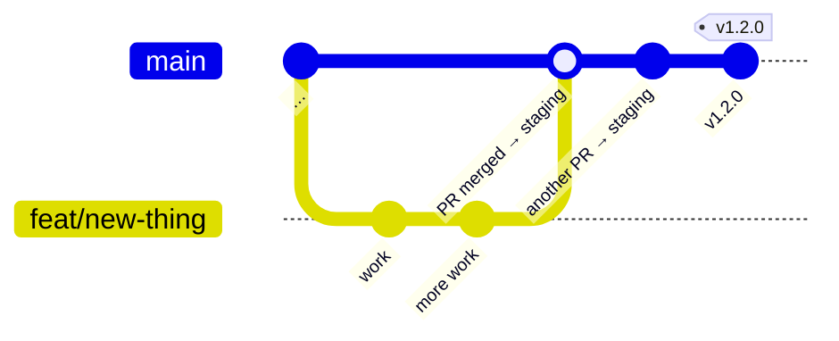
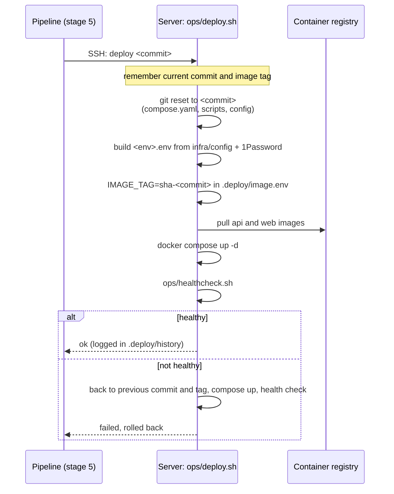

# Deployment

## Branches and releases



- **`main` is the integration branch.** Every pull request merges into it, and every merge deploys to **staging** automatically.
- **A release is a tag** (`v1.2.0`) on a commit of `main` that's been running well on staging. The tag deploys that exact build to **production** (planned; see below).
- Feature branches are short-lived: `feat/…`, `fix/…`, `ci/…`, `docs/…`, `chore/…`.

Nobody pushes to `main` directly. A branch ruleset requires a pull request and the pipeline's required checks, and blocks force pushes and deletion.

## Environments

| | Staging | Production |
| --- | --- | --- |
| Address | `stage.xove.app` | `xove.app` |
| Receives | Every merge to `main`, automatically | Tagged releases |
| Access | An extra gate in front of the app, then normal sign-in | Normal sign-in |
| Database | Its own | Its own |
| Search engines | Told not to index (`X-Robots-Tag: noindex`) | Normal |

Both environments run on the same server from separate checkouts of this repository. Their settings are generated per environment from the `infra` repo and 1Password ([settings and secrets](operations.md#settings-and-secrets)), never written by hand or committed. Container names carry the environment (`xove-stage-api`, `xove-prod-api`), so they can run side by side. A shared reverse proxy, configured in a separate private repository, routes each hostname to its containers and handles HTTPS.

## How a deploy works



Key points:

- **The server never builds.** It pulls images the pipeline built, tested and scanned.
- **The SSH key can do one thing.** On the server, the pipeline's key is restricted to running `ops/deploy.sh` (a forced command), so it can't open a shell. The script only accepts `deploy <40-character commit>`, `rollback` or `status`.
- **Rollback is automatic.** If the new version isn't healthy within 3 minutes, the script puts back the previous commit and images, checks health again, and reports the failure. Stage 6 of the pipeline then deletes the failed images.
- **The checkout follows the images.** The script moves the server's checkout to the deployed commit, so `compose.yaml` and the LiveKit config always match the code that's running.

### Database migrations and rollback

Flyway runs new migrations when the API starts. A rollback puts back the old code, but **it doesn't undo migrations**. So every migration must keep working with the previous version of the code:

- Adding a table or a nullable column: safe.
- Renaming or dropping a column: do it in two releases. First release: add the new column and write to both. Second release, once the first is proven: stop using the old one and drop it.

## Deploying by hand

On the server, from the environment's checkout:

```bash
ops/deploy.sh status                  # what's running, recent deploys, container status
ops/deploy.sh deploy <commit-sha>     # deploy a commit whose images were published
ops/deploy.sh rollback                # go back to the previous deploy
```

The images for a commit exist only if its pipeline reached stage 4.

## Setting up a server for pipeline deploys

One-time steps per environment. Values (host, user, keys) go in 1Password, not here.

1. **Checkout and settings:** clone the repository on `main` into the environment's folder, and the `infra` repo into `/srv/infra`. Install the 1Password CLI and `python3-yaml`, put the `xove-server` service account token in `~/.config/op/token` (`chmod 600`), and check the environment's settings resolve: `/srv/infra/ops/build-env <env> --check`.
2. **Registry login:** the images are private, so the server logs in to GitHub Container Registry once with a personal access token (classic) that has only `read:packages`: `docker login ghcr.io`.
3. **Deploy key:** generate a dedicated key pair. Add the public key to the deploy user's `authorized_keys` with a forced command and no extras:
   ```
   command="/path/to/checkout/ops/deploy.sh",no-port-forwarding,no-X11-forwarding,no-agent-forwarding,no-pty ssh-ed25519 AAAA… github-actions-deploy
   ```
4. **Pipeline secrets:** store the private key, the server's host key (`ssh-keyscan`), host, port and user in the `deploy-ssh` item of the `Xove CI` vault (see [Pipeline](pipeline.md#secrets-the-pipeline-uses)).
5. **First deploy:** merge anything to `main`, or run the pipeline manually. The first deploy has nothing to roll back to, so watch it.

## Production releases (planned)

1. Pick a commit on `main` that has been on staging and works.
2. Tag it: `git tag v1.2.0 <commit> && git push origin v1.2.0`. Only the maintainer can create `v*` tags.
3. A release workflow tags that commit's `sha-…` images as `v1.2.0` (no rebuild), deploys them to production with the same script and rollback, and checks production's health on the server.
4. Rolling back production means deploying the previous tag.

Until then, production shows a placeholder page.
