# Design sheet

Everything Xovê looks like, in one place: the name, the mark, the icons, the colours, the type, the shapes and motion, every control, and each screen on desktop, tablet and phone. It's the reference for new work, by people and by Claude: **use what's here before adding anything new**, and update this page in the same PR when the look changes.

The pictures are shot from the real app (`design-sheet.mjs`, see [Keeping this page current](#keeping-this-page-current)). The values come from the code: `web/src/styles/global.css` (the tokens), `web/src/brand/` (the mark) and each component's CSS module.

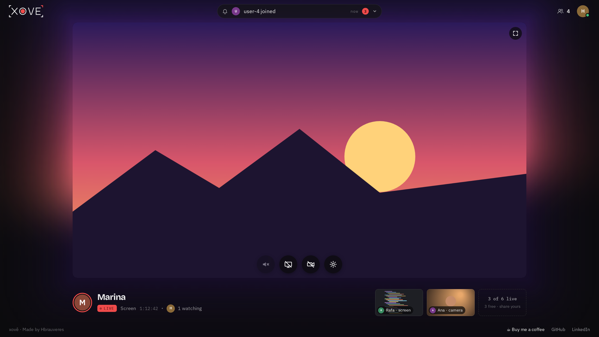

## Contents

- [Name and voice](#name-and-voice)
- [The mark](#the-mark)
- [Icons and favicon](#icons-and-favicon)
- [Colour](#colour)
- [Type](#type)
- [Shape and spacing](#shape-and-spacing)
- [Motion](#motion)
- [Controls](#controls)
- [Notifications and status](#notifications-and-status)
- [Screens and layouts](#screens-and-layouts)
- [Accessibility](#accessibility)
- [Rules for new work](#rules-for-new-work)
- [Keeping this page current](#keeping-this-page-current)

## Name and voice

- **Xovê**, with the circumflex, in every sentence and label. `xove` only where an accent can't go: the domain (`xove.app`), repos, code, image and container names. The wordmark is written in capitals, **XOVE**, and its red corner stands in for the ^.
- **Short, plain sentences**, in sentence case: "Share your screen", "Full-screen view", "Nobody live · 0 of 6 · 6 free", "Xovê works best from your home screen". No exclamation marks, no jargon.
- **Say what happens, then what to do:** "The room is full. You're 2nd in line." A disabled control says why in its tooltip.
- **The middle dot (·)** joins short facts on one line: "Marina · Screen", "3 of 6 live · 3 free".
- **Every control has a spoken name** (`aria-label`) that says what it does or what it shows: "Watch Rafa's screen", "4 people here", "Henrique: account, connected".

## The mark

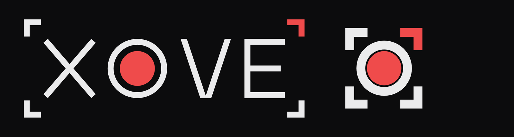

- **The wordmark:** [XOVE] in a slim viewfinder. The O is a record button: a white ring as thick as the letters and a red dot inside. Four corners frame the word; the **top-right corner is red**.
- **The symbol:** the record O alone, inside the same four corners. It's the app icon and the favicon.
- **Construction** (`web/src/brand/mark.ts`, the only place the geometry lives): one grid with a cap height of 100 and a stroke of 10. Letter widths X 88, O 100, V 90, E 68, gaps 20. The viewfinder sits 28 from the letters, with arms of 24 (26 in the symbol). The dot's radius is 29.4 in an O 100 across. The X ends square, the V's tips are cut flat at the cap height.
- **Colours:** white strokes (`--text`, `#ebebec`), the red dot and corner (`--accent`, `#ef4b4b`), on the soft black ground. Never recoloured, outlined, stretched or put on a busy picture.
- **Drawn, not typed:** `components/brand/XoveMark` (the wordmark, inline SVG, named "Xovê" for screen readers) and `XoveIcon` (the symbol). In the header it's about 110 px wide.
- **The hover animation** (`brand/markTimeline.ts`, `useMarkAnimation`): pointing at the wordmark (or focusing it) plays it once, in about 3 seconds. The left corners stay and the word slides under them until the X is gone, while the right corners close in on the O; the corners settle into the symbol; the dot double-blinks like a surprised eye; everything plays back. A new hover doesn't restart it, and it never plays with reduced motion.
- **Three optical sizes of the symbol** (`iconMark("large" | "small" | "tiny")`): **large** (64 px and up) is slim, about 70% of its square; **small** (32 px) and **tiny** (16 px) have heavier strokes and fill more of the square, tiny edge to edge. The outer edges match in all three.

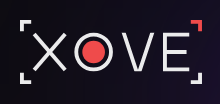

## Icons and favicon

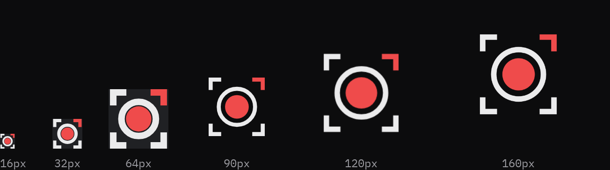

| File | What | Notes |
| --- | --- | --- |
| `web/public/favicon.svg` | The tiny symbol, for the tab and bookmarks | Its white parts turn soft black when the browser is in light mode (a `prefers-color-scheme` rule inside the file); the red stays |
| `apple-touch-icon.png` | iPhone home screen | The large symbol on the soft black ground |
| `icon-192.png`, `icon-512.png` | Android home screen, install prompt | Same |
| `icon-maskable-512.png` | Android's shaped icons (circle, squircle) | The mark sits inside the 80% safe circle (its farthest pixel 191 px from the centre, the safe radius 205) |
| `site.webmanifest` | Name, icons, `theme_color` and `background_color` `#0c0c0d`, `display: fullscreen` | Opened from the home screen, no browser bar |

`node scripts/brand-icons.mjs` (from `web/`) rewrites the favicon from `mark.ts`; `--maskable` renders the maskable icon. A test fails if the favicon drifts from the geometry.

**Interface icons** are drawn inline as SVG in the components, on a 20 × 20 grid (12 × 12 for the small arrows), with round 1.5–2 px strokes in `currentColor`, so they take the colour of their button. There's no icon library: a new icon follows the same grid and stroke.

## Colour

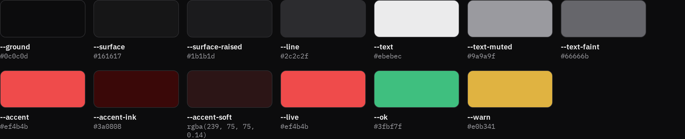

Dark only: Xovê is a room for watching screens, so the chrome stays out of the way of whatever is on the stage.

| Token | Value | Use |
| --- | --- | --- |
| `--ground` | `#0c0c0d` | The page: soft black |
| `--surface` | `#161617` | Panels |
| `--surface-raised` | `#1b1b1d` | Raised surfaces, hovers on ghost buttons |
| `--line` | `#2c2c2f` | Borders and dividers |
| `--text` | `#ebebec` | Text, white strokes, the mark |
| `--text-muted` | `#9a9a9f` | Secondary text |
| `--text-faint` | `#66666b` | Labels that can be faint (3:1 at least) |
| `--accent` | `#ef4b4b` | **The one accent**, red, the record light: live pills, on-air rings, the unseen count, focus rings, the switch when on, primary buttons |
| `--accent-ink` | `#3a0808` | Text and icons on a red fill (4.7:1) |
| `--accent-soft` | `rgba(239, 75, 75, 0.14)` | Soft red glows and tints |
| `--live` | `#ef4b4b` | LIVE, the live dot, danger buttons |
| `--ok` | `#3fbf7f` | Connected, the seats bar |
| `--warn` | `#e0b341` | Reconnecting |

- **Pure black `#000` only behind the video:** the stage, the previews, the facecam and the share preview, as the picture's own frame. Nowhere else.
- **Red is rare on purpose:** it means the brand or something live. Sliders are white and the switch is grey until it's on.
- **Avatars** without a photo get the person's own hue: `hsl(<hue> 42% 38%)` with a white initial.
- **The empty stage's colour bars** keep their colours, at full strength, and the ambilight glows from them.
- **The ambilight** takes its colour from the picture, never from the palette.
- **Contrast:** every text colour reaches 4.5:1 on every surface, 3:1 for faint labels. `styles/palette.test.ts` computes it and rejects the old palettes (amber, blue-tinted greys).

## Type

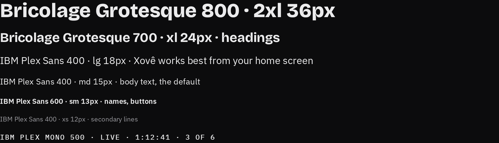

| Font | Token | Use |
| --- | --- | --- |
| **Bricolage Grotesque** 500 / 700 / 800 | `--font-display` | Headings, the name of who's on the stage, big statements ("The stage is yours.") |
| **IBM Plex Sans** 400 / 500 / 600 | `--font-body` | Everything else: body, buttons, names in lists |
| **IBM Plex Mono** 400 / 500 | `--font-mono` | Counters and times: LIVE, `1:12:41`, "3 of 6 live", section labels like "LIVE NOW" |

| Size token | rem | px | Typical use |
| --- | --- | --- | --- |
| `--text-xs` | 0.75 | 12 | Secondary lines, timestamps |
| `--text-sm` | 0.8125 | 13 | Names in rows, small buttons, captions |
| `--text-md` | 0.9375 | 15 | Body (the default), buttons |
| `--text-lg` | 1.125 | 18 | Stage messages, dialog titles |
| `--text-xl` | 1.5 | 24 | Page headings |
| `--text-2xl` | 2.25 | 36 | The largest headings |

Body line height is 1.5; headings balance their lines (`text-wrap: balance`). Fonts load from Google Fonts with `display=swap`; fallbacks are Segoe UI and the system sans.

## Shape and spacing

| Token or value | Use |
| --- | --- |
| `--radius-sm` 6 px | Buttons, the facecam, small boxes |
| `--radius-md` 10 px | Cards, dialogs (the seat offer) |
| 16 px | Dropdown panels |
| 999 px (pill) | Round buttons, the activity pill, badges, dots |
| `--gutter` 16 px | The page's side margin, and the minimum on a phone |

- **Frosted glass** for things floating over the stage or the page: dark at 72–74% with a blur (8 px for the round buttons, 22 px for panels).
- **Clear cuts:** stacked panel sections are separated by a 2 px gap that shows the page behind, never a drawn line.
- **Touch targets** are at least about 36 px (the switch keeps a 36 × 20 px target; the stage's dots an 18 px one around a 6 px dot).

## Motion

| What | Duration | Easing |
| --- | --- | --- |
| Button hover and press | 120 ms (press moves 1 px down, 80 ms) | ease |
| Slider knob growing | 120 ms | — |
| Switch knob | 180 ms | ease |
| Stage dots | 180 ms | ease |
| Dropdown unroll and roll back | 260 ms, by its height | `cubic-bezier(0.2, 0.8, 0.2, 1)` |
| A new activity in the pill | 350 ms | ease |
| Facecam buttons fading | 250 ms | ease |
| The stage resizing to a new picture | 350 ms | ease |
| Controls over a playing stream | fade after about 2.5 s without a touch or mouse move; back on any move | — |
| The ambilight following the picture | 120 ms time constant, with the screen's refresh (at most 60 a second) | — |
| The live dot's ping | 1.8 s, looping | ease-out |
| The mark's hover animation | about 3 s, once | — |

- **Panels never clip, fade or filter** while they move: that would stop their blur. They unroll by their height.
- **With reduced motion**, every animation and transition is cut to nothing (a global rule), the mark doesn't play, swipes change at once and the ambilight updates every 500 ms.

## Controls

### Round buttons

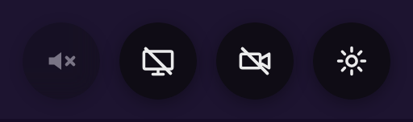

- **48 px** circles in a pill (42 px on a phone and on screens under 520 px wide), dark frosted glass (`rgba(10, 10, 11, 0.72)`, blur 8 px, a soft shadow), white icon.
- **Order**, centred at the bottom of the stage: volume, screen, camera, settings.
- **Live:** the pill turns red (`--accent`) with a deep-red icon (`--accent-ink`), and grows a 26 px arrow on its right that opens the stream's menu.
- **Hover and focus:** a white wash at 12% (black at 12% on red). **Focus** draws one red ring around the whole pill, arrow included.
- **Unavailable** (a full room, no sound): 45% opacity, with the reason in the tooltip.
- They fade with the rest of the controls while a stream plays, and come back on any move.

### Buttons

| Variant | Look | Use |
| --- | --- | --- |
| Primary | Red fill, deep-red text; lighter red (`#f36a6a`) on hover | The one main action on a page ("Get Xovê", "Request access") |
| Ghost | Transparent, muted text, a `--line` border; raised surface on hover | Secondary actions |
| Danger | Transparent, red text and a red border at 55% | Removing a member, stopping |

Two sizes: **md** (10 × 18 px padding, 15 px text) and **sm** (6 × 12 px, 13 px). Weight 600, `--radius-sm`, 45% opacity when disabled.

### Sliders

`components/ui/Range`, white like a video player's: a **3 px track**, white up to the knob and `#ebebec` at 22% after, and a **12 px white knob** that grows to 14 px on hover or keyboard focus. Used for the ambilight's brightness, the stage's volume (vertical, sliding up from the volume button while it's pointed at) and each preview's volume (horizontal).

### Switch

A slim grey track (**36 × 14 px**, `#3a3a3d`) that looks the same off and on, and a **20 px knob** that overhangs it: `#bdbdc0` when off, red when on, sliding in 180 ms. The ambilight's on/off in the account menu.

### Dropdown panels

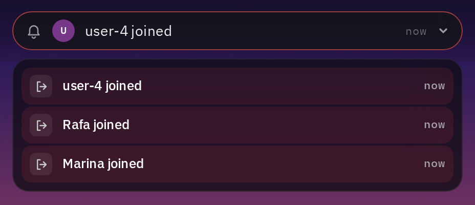

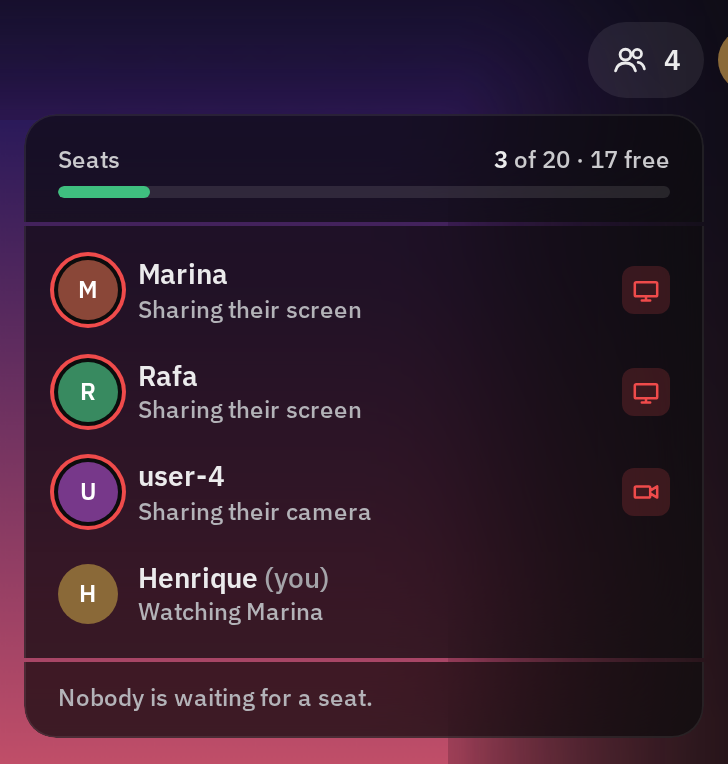 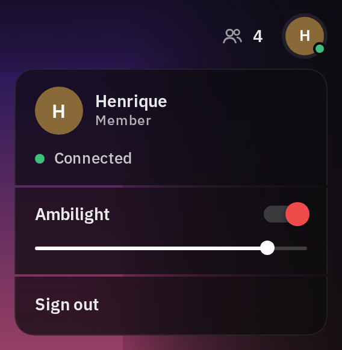

- Frosted sections (dark at 74%, blur 22 px, a 1 px white border at 8%), **16 px corners**, stacked with 2 px clear cuts. 340 px wide (the activity list: up to 440 px, centred under the pill).
- Open 8 px under their button; **one at a time**; they unroll by their height (260 ms).
- **Activity:** the latest events, each with its icon, what happened and when. **People:** the seats bar (green), who's here and what each is doing or watching, and the queue. **Account:** me and my connection, the ambilight's switch and brightness, Admin for admins, Sign out; on a phone, the footer's links at the end.
- Sideways on a phone they're as tall as the screen allows and scroll inside.

### Avatars and LIVE

- **Avatars:** round, the person's photo or their hue with a white initial (`hsl(<hue> 42% 38%)`), weight 700.
- **On air:** a red ring with a ground-coloured gap, outside the avatar in lists and **inside its edge** in the info row, so its outer edge stays the avatar's.
- **LIVE badge:** a filled red pill with a deep-red dot and "LIVE" in mono, next to the stream's kind and its running time.
- **The live dot:** 8 px red, with a ring that pings outward every 1.8 s.

### On the stage

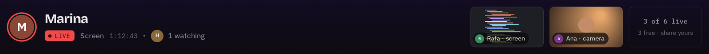

- **The info row:** on the left, who's on the stage (avatar with its ring, name in the display font, LIVE, what, how long) and who's watching (up to 4 avatars and "N watching"); on the right, the other streams as **previews** with a name chip, then a dashed box "N of 6 live · N free · share yours", gone when all 6 are live.
- **The facecam:** the camera as a small window over the screen, 24% of the player's width, `--radius-sm`, with 28 px round buttons (swap views, collapse) that fade with the controls; collapsed, a 28 × 44 px tab at the right edge. It can be dragged, or moved with the arrow keys.
- **The fullscreen button:** top right on desktop; on a phone in the upright full view, bottom right, level with the round buttons.
- **Stage dots** (phone, more than one live): 6 px dots just above the round buttons, the current one stretched to 14 px; a tap jumps to that person.

## Notifications and status

- **The activity pill** (desktop header, centre): 38 px tall, up to 440 px wide, frosted. It shows the latest event with its person and time, and a **red count** (18 px pill) of the ones not seen yet. A click opens the activity list; a live stream's event puts it on the stage.
- **The bell** (phone): the same list, with no count or dot, between the people button and my account.
- **Losing the connection** takes over the pill: **yellow** (`--warn`), with a 12 px spinner, until it's back. The account button's dot is green when connected.
- **Stage messages** (`StageNotice`): centred over the stage, a title in `--text-lg` and a line under it (up to 42 characters wide, `--text-sm`), with a 22 px spinner while something loads ("Loading Marina's screen…").
- **The seat offer:** when a seat frees up for someone in the queue, a dialog (up to 400 px, `--radius-md`) offers it for 60 seconds, with the time running down.
- **The waiting room:** the place in the queue, in plain words, while the room is full.
- **Tooltips** say why a control can't be used.

## Screens and layouts

### Which layout

| Device | Held upright | Held sideways |
| --- | --- | --- |
| **Phone:** touch first (`pointer: coarse`), shorter side ≤ 500 px | Upright view | Sideways view |
| **Tablet:** touch first, larger | Upright view (in a 640 px column under the stage) | Desktop layout |
| **Desktop** | Upright view if the window is ≤ 760 px wide and upright | Desktop layout |

Turning switches layouts at once, and the stage keeps its place in the page, so the video never reloads. Phones and tablets use Xovê only as a home-screen app; in a browser tab they see the install screen.

### Desktop: theater mode


- **Header** (see-through, full width): the wordmark, the activity pill in the centre, the people button and my account on the right. **Footer:** plain muted text, "Made by Hbrauveres", and white "Buy me a coffee" among muted links.
- **The stage** fills a 16:9 box as big as the window allows, and **hugs the picture**: a wider picture keeps the full width and gets shorter, a taller one keeps the full height and gets narrower, centred, with no black bars. On a window taller than 16:9 (a vertical monitor), the box may take all the height above the info row, so portrait pictures fill it. Empty and loading stages are 16:9.
- **The ambilight** glows around the stage from the picture's edges, soft and slow.
- **The info row** under the stage is exactly as wide as the 16:9 box.

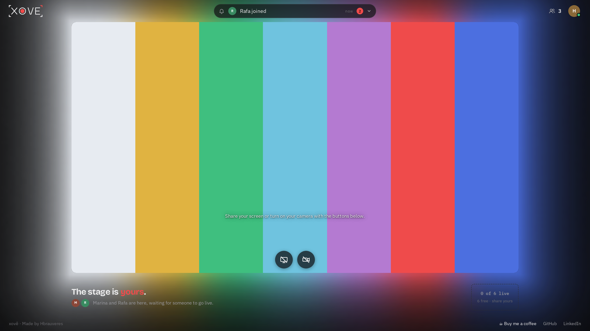

**Nobody live:** colour bars on the stage (full colour, lit by the ambilight), "The stage is yours." and the round buttons to start.

### Phone, upright

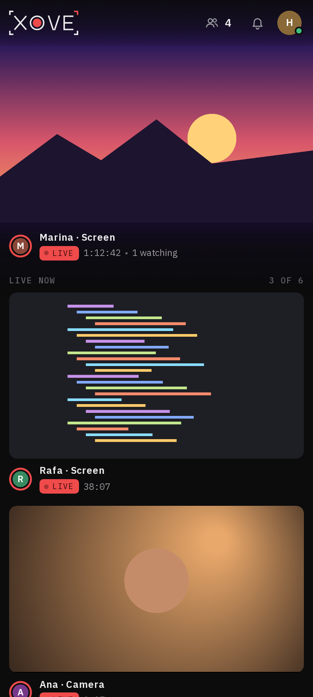 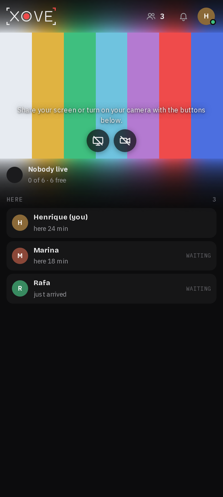

- **Top bar:** the wordmark; the people button, the bell and my account on the right. No footer: its links end the account menu.
- **The stage** edge to edge under the top bar, never taller than 60% of the screen, with the round buttons and the dots on it; a swipe left or right changes who's on it.
- **Under it, the only part that scrolls:** "LIVE NOW · 3 OF 6" and the other streams as a **feed** of full-width pictures, each with the compact info row; a tap puts one on the stage. With nobody live: who's here as **cards**, with how long each has been here.

### Phone, sideways

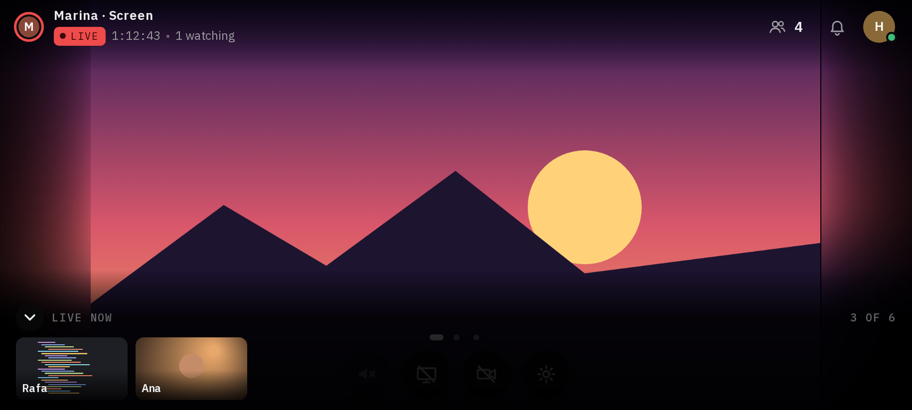

- **No header or footer:** the stage fills the height and hugs the picture, black at its sides where the light glows.
- **A top bar** over a black gradient: who's on the stage on the left; the people button, the bell and my account on the right.
- **The round buttons** at the bottom; a round arrow button at the bottom left opens the **streams row** (small silent pictures with names, over a black gradient), as does a swipe up.
- Everything fades about 2.5 s after the last touch while a stream plays.
- **The full-screen view:** upright, the fullscreen button shows this same layout without turning the phone.

### Tablet, upright

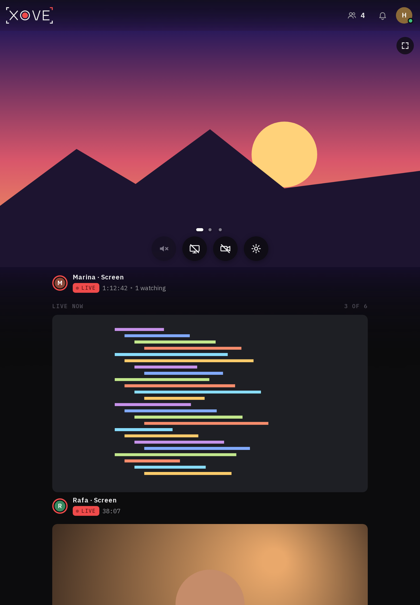

The phone's upright view, with the stage full width and the info row and feed in a centred column up to 640 px wide. Sideways, a tablet gets the desktop layout.

### The install screen

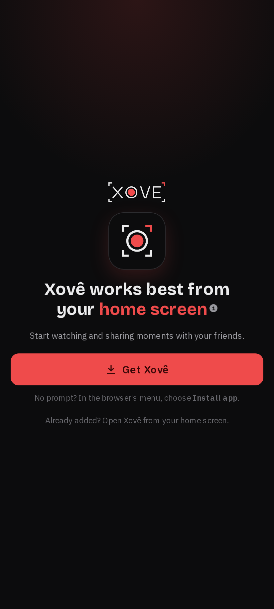 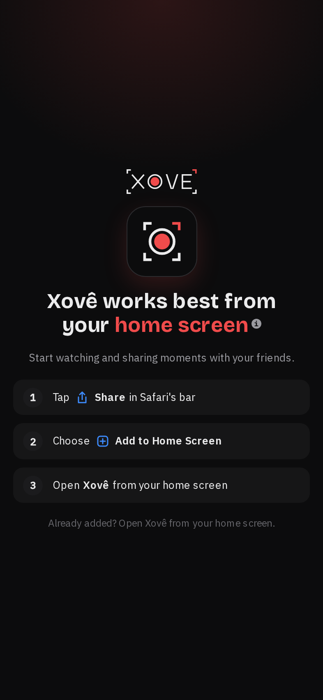

What a phone or tablet sees in a browser tab, on every page: the wordmark, the symbol in a rounded tile with a soft red glow, the headline "Xovê works best from your **home screen**" (the last words in red) with a small "i" that shows why, and the action. **Android:** a primary "Get Xovê" button (the browser's install prompt) and a hint for the browser's menu. **iPhone and iPad:** Safari's three Share steps. Centred, with a soft glow from the top that fades out before the wordmark.

## Accessibility

- **Focus is always visible:** a 2 px red ring, 2 px out (3 px around the round buttons' pill, white 4 px out around sliders).
- **Keyboard:** every control is a real button or input; the volume opens on focus; the facecam moves with the arrow keys; Escape closes panels.
- **Names:** every control and picture has a spoken name; the mark is "Xovê"; videos are named by whose stream they are.
- **Contrast** as in [Colour](#colour), checked by a test.
- **Reduced motion** as in [Motion](#motion).

## Rules for new work

- **Use the tokens.** A new colour, size or font is a design decision: it needs a draft and Henrique's approval, then it lands in `global.css` and here.
- **Red means the brand or live.** Don't use it for anything else.
- **Draft first:** a visual change starts as a clickable HTML draft with these tokens and fonts, approved before the spec. The approved draft is the reference the code must match.
- **Check every size:** desktop 1920 × 1080, vertical monitors (1080 × 1920 and 1440 × 2560), a narrow window, phones upright (412 × 915, 360 × 740) and sideways (915 × 412, 667 × 375), tablets (820 × 1180, 1180 × 820), the empty room and the install screen.
- **Reuse the components:** `RoundButton` styles, `Button`, `Range`, the switch, `Dropdown`, `Avatar`, `LiveDot`, `StageNotice`. A new control follows their sizes, motion and focus ring.
- **Say what effects cost:** blur, canvases and animations run on every frame; keep them to what's here.

## Keeping this page current

The pictures come from the real app with fake people and moving pictures, in a headless browser. After a visual change, retake them and update the text in the same PR:

```bash
# from the private workspace, with the harness running (its /device-check skill)
node .claude/skills/device-check/scripts/design-sheet.mjs repos/xove
```
