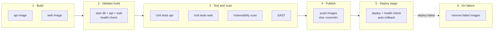

# Pipeline

Xovê's CI/CD runs on GitHub Actions. It turns every change into a Docker image that has been built once, started, tested and scanned, and only then published and deployed.

## The three pipelines

| Pipeline | File | Runs on | Stages |
| --- | --- | --- | --- |
| **Commit checks** | [`ci.yml`](../.github/workflows/ci.yml) | Every push to any branch except `main` | 1 · Build → 2 · Validate → 3 · Tests and scans |
| **Stage release** | [`stage.yml`](../.github/workflows/stage.yml) | Every push to `main` (a merged pull request) | The same commit checks, then 4 · Publish → 5 · Deploy stage → 6 · Cleanup on failure, and a Discord message with the result |
| **Production release** | [`release.yml`](../.github/workflows/release.yml) | A version tag `vX.Y.Z`, or its "Run workflow" button (rollback) | 1 · Check the release → 2 · Tag the images → 3 · Deploy production → 4 · Check production → 5 · Roll back production (only if the check fails) → 6 · GitHub Release, and a Discord message |

The commit checks are one reusable workflow: the stage release calls it instead of repeating it, so "what a commit must pass" is defined in one place.

**Every commit is checked**, not only pull requests. Push a branch and its run shows up in the Actions tab and next to the commit, before any pull request exists. When you open the pull request, its required checks are these same runs: GitHub matches checks by commit, so nothing runs twice.

## Stages

| # | Job | What it does | Fails when |
| --- | --- | --- | --- |
| 1 | **Build (api)**, **Build (web)** | Builds each Docker image from its `Dockerfile` (the Java build and the React build happen inside). Layers are cached between runs, except that the web image rebuilds Caddy from source on the latest Go once a day (the build gets today's date as `REFRESH`). Each image is saved as an artifact for the next stages | The code doesn't compile, TypeScript has type errors, the Docker build breaks |
| 2 | **Validate build** | Loads both images and starts db, api and web with Compose, exactly as a server would. Waits for the API health endpoint and the web page, and checks that the API refuses anonymous requests (401) | An image doesn't start, a migration fails, the app crashes on boot, security isn't wired |
| 3 | **Unit tests (api)** | `./mvnw verify`: JUnit with a real PostgreSQL from Testcontainers | Any test fails (reports are attached to the run) |
| 3 | **Unit tests (web)** | `npm ci` and `npm test` (Vitest) | Any test fails |
| 3 | **Vulnerability scan** | Trivy scans both images (OS packages and the Java libraries inside the jar) and the web dependencies (`package-lock.json`) | A HIGH or CRITICAL vulnerability **with a fix available** is found |
| 3 | **SAST** | Semgrep scans the source with its default, Java, TypeScript, React, secrets and Dockerfile rules | Any finding |
| 4 | **Publish images** | Pushes both images to GitHub Container Registry as `xove-api:sha-<12 chars of the commit>` and `xove-web:sha-…` | Registry errors |
| 5 | **Deploy stage** | Asks the staging server over SSH to deploy that commit (see [Deployment](deployment.md)), then tags the images `:stage` | The new version isn't healthy (the server rolls back by itself first) |
| 6 | **Remove failed images** | Deletes the images of a commit that ran on staging and wasn't healthy (the deploy tool's exit code 2), so nobody runs them by mistake. A deploy refused before anything changed (GitHub, the registry or 1Password unreachable, another deploy running) keeps them: re-run the whole workflow. GHCR deletes whole versions, so a version that also carries other tags (a commit that didn't change that image shares it with earlier commits) is kept | — |

Jobs in the same stage run in parallel. Each job starts on a fresh machine, which is why images travel between stages as artifacts.

**Build once, promote.** The image deployed to staging is the one that was built in stage 1 and tested in stages 2 and 3, not a rebuild. Production reuses that same image, with a version tag added.

## When it runs

| Event | Pipeline | Stages | Why |
| --- | --- | --- | --- |
| Push to a branch (any commit) | Commit checks | 1 → 3 | Every commit is validated; the pull request's **required checks** come from here |
| Push to `main` (a merged PR) | Stage release | 1 → 5 (6 on failure) | Checks the merged result again, then publishes and deploys to staging |
| Tag `vX.Y.Z` | Production release | 1 → 4 (5 if the check fails), then 6 | Ships a build that already ran on staging |
| Manual on **Production release** | Production release | 5 only | Rolls production back to the version that ran before |
| Manual ("Run workflow" button) on **Commit checks** or **Stage release** | That one | Same as above; a stage release from a branch stops after the checks | Re-run on demand; only `main` is released (the server refuses other commits) |

A new push to a branch cancels that branch's older run. Stage releases always finish and run one at a time, in merge order.

## Required checks

The `main` branch only accepts changes through a pull request whose checks pass:

- `1 · Build (api)`, `1 · Build (web)`
- `2 · Validate build`
- `3 · Unit tests (api)`, `3 · Unit tests (web)`, `3 · Vulnerability scan`, `3 · SAST`

They come from the **Commit checks** runs on the pull request's last commit. (Inside a stage release the same jobs show as `Checks / 1 · Build (api)` and so on, because they're called from the `Checks` job; those names aren't used by the ruleset.)

Renaming a job changes its check name. When that happens, update the branch ruleset (Settings → Rules → Rulesets), or merges wait forever for a check that no longer exists.

## When something fails

| Failed job | Where to look | Typical fix |
| --- | --- | --- |
| Build | The job log, near the end | Fix the compile or type error; run `npm run build` or `./mvnw package` locally |
| Validate build | "Show logs" step: last 200 lines of every container | Usually a startup error: a missing setting, a bad migration |
| Unit tests (api) | Log, plus the `api-test-reports` artifact | Run the failing class locally: `./mvnw test -Dtest=ClassName` |
| Unit tests (web) | Log | `npm test` locally |
| Vulnerability scan | Log, one group per target | Upgrade the library or base image named in the table (see policy below) |
| SAST | Log: file, line and rule | Fix the code; if it's a false positive, add a `# nosemgrep: <rule-id>` comment with the reason |
| Deploy stage | Log shows the server's own output, including the rollback | Staging is already back on the previous version. Fix forward with a new PR |
| Check the release (production) | Log: which check failed | Tag a commit that is on `main` and has a green stage release |
| Deploy production / Check production | Log shows the server's output, or which address didn't answer | Production is back on the previous version (the server or stage 5 rolled it back), unless Discord or the log says the rollback failed or there was nothing to roll back to: then check the server. Fix forward, then tag a new version |

To retry a flaky job: open the run and click **Re-run failed jobs** (or `gh run rerun <run-id> --failed`).

**Discord notifications.** Every stage release, production release and rollback ends with **Notify Discord**, which posts to a Discord channel through a webhook: success (which `sha-…` is live on staging, or which version is live on production), failure or cancellation, the commit, each stage's result and links to the run and to the environment. It never pings anyone (mentions are disabled), and it only warns in the run if the webhook secret is missing. Commit checks on branches don't notify: you're watching those as you push. Production releases run one at a time; if two wait at once, GitHub keeps only the newest, and the replaced one posts nothing.

## Vulnerability policy

The scan blocks on HIGH and CRITICAL vulnerabilities that have a fixed version, because those can be acted on right away.

1. **Upgrade.** Bump the library, or rebuild on a newer base image. For a library that comes with Spring Boot, override its version property in `api/pom.xml` (for example `<tomcat.version>`) until Spring Boot ships the fix, with a comment saying when to remove it.
2. **If there's no way to upgrade yet** and the vulnerability doesn't affect Xovê, add its ID to `.trivyignore` with a comment: why it doesn't apply, and a date to check again. Never ignore without a reason and a date.

Dependabot (`.github/dependabot.yml`) opens weekly pull requests for Maven, npm, Docker base images and the actions themselves. Each one goes through this same pipeline, so a green Dependabot PR is safe to merge. A new version waits 7 days before Dependabot proposes it (security updates don't wait), and every action in the workflows is pinned to a full commit SHA with its version in a comment (`@<sha> # v4.4.0`), so a moved tag can't change what runs; Dependabot updates the SHA and the comment together. Semgrep enforces both.

## Secrets the pipeline uses

Only one secret is stored in GitHub: `OP_SERVICE_ACCOUNT_TOKEN`, the read-only token of the `xove-ci` 1Password service account. The jobs that need secrets load them from the `Xove CI` vault with 1Password's `load-secrets-action` (pinned by SHA); values are masked in the logs. The references are in `stage.yml`, `release.yml` and `.github/actions/dockerhub-login`, so the workflow shows where every value comes from.

| Value | Reference | Used by |
| --- | --- | --- |
| Deploy key | `op://Xove CI/deploy-ssh/private_key` (the field id: labels are translated, ids aren't) | Deploy stage: a key that can only deploy staging |
| Production's deploy key | `op://Xove CI/deploy-ssh-prod/private_key`, plus its `known-hosts`, `host`, `port`, `user` | Deploy production, Roll back production: a key that can only deploy production |
| Server host key | `op://Xove CI/deploy-ssh/known-hosts` | Deploy stage: the runner checks it reaches the real server |
| Host, port, user | `op://Xove CI/deploy-ssh/host`, `port`, `user` | Deploy stage |
| Docker Hub login | `op://Xove CI/dockerhub/username`, `password` (a read-only access token) | Every check that pulls from Docker Hub (build, validate, api tests, vulnerability scan, SAST): logged in, the pulls count against our account, not the anonymous limit GitHub's shared runners run out of (`429 Too Many Requests`). Dependabot's runs have no token, so they pull anonymously |
| Discord webhook | `op://Xove CI/discord-webhook/password` | Notify Discord: anyone with it can post in the channel |
| `GITHUB_TOKEN` | created by GitHub for each run | Publish, deploy, cleanup: push and delete images; production: tag images, create the GitHub Release |

The stage deploy has no check from outside (production's has one, since it has no gate): `infra`'s `ops/deploy.sh` checks health on the server (the `healthcheck:` entries in `compose.yaml`) and rolls back by itself (decision 27). Notify Discord also reads its webhook from the vault, so if 1Password or the token fails, that run posts nothing: the failed job in the Actions tab is the signal.

## Adding a stage or a job

Stages aren't a GitHub keyword: order comes from `needs:`. Checks that every commit should pass go in `ci.yml`; steps that only make sense after a merge (publishing, deploying, DAST against staging) go in `stage.yml`. To add a job to stage 3, add it to `ci.yml` with `needs: validate` and name it `3 · Something`. To add a whole stage between two others, point its `needs:` at the earlier stage's jobs and point the later stage at the new one. Then add any new blocking job to the required checks.

Ideas already on the list: DAST (OWASP ZAP against staging, after stage 5) and performance tests.
