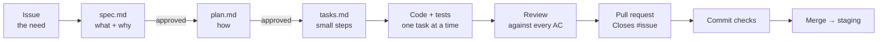

# Specs

Xovê is built spec-first: every change starts as a written, reviewed spec, and a pull request proves each of its acceptance criteria. This folder holds those specs.

## The flow

| Stage | Output | Who | Claude Code command |
| --- | --- | --- | --- |
| 1. Need | GitHub issue (Feature or Bug template) | Anyone | — |
| 2. Spec | `specs/<issue>-<slug>/spec.md`: problem, users, functional requirements, acceptance criteria, out of scope | Claude drafts, **Henrique approves** | `/spec <issue>` |
| 3. Plan | `plan.md`: design, files touched, data and API changes, risks, test plan | Claude drafts, **Henrique approves** | `/plan <spec folder>` |
| 4. Tasks | `tasks.md`: ordered steps, each small, testable and tied to FRs/ACs | Claude | `/tasks <spec folder>` |
| 5. Build | Code and tests, one task at a time, ticked in `tasks.md` | Claude, reviewed by Henrique | `/implement <spec folder>` |
| 6. Review | Every AC checked against the diff; gaps listed | Reviewer subagent | `/review <spec folder>` |
| 7. Ship | PR with `Closes #<issue>` and the AC checklist; checks green; merge | Henrique | — |

Nothing is coded before its spec and plan are approved. The approval is a comment on the issue ("spec approved", "plan approved") so the decision is on record.

## Naming

- Folder: `specs/<issue number, 4 digits>-<short-slug>/`, e.g. `specs/0012-stale-slot/`.
- Requirements: `FR-1`, `FR-2`… and acceptance criteria `AC-1`, `AC-2`… numbered inside each spec, so a PR can say "covers FR-2, AC-3".
- A decision that outlives the spec goes to `docs/decisions.md`, with a link back to the spec.

## Definition of Ready (before `/plan`)

- The issue explains the need in the user's words.
- `spec.md` lists functional requirements and **testable** acceptance criteria (each one can be checked by a test or a written manual step).
- Out of scope is written down.
- Henrique commented "spec approved" on the issue.

## Definition of Done (before merge)

- Every task in `tasks.md` is ticked.
- Every AC is covered by an automated test or a manual check recorded in the PR.
- The commit checks are green (build, validate, tests, vulnerability scan, SAST).
- `docs/` is updated if behaviour, setup, the pipeline or a decision changed.
- The PR links the issue (`Closes #…`) and ticks the AC checklist.

## Backlog board

GitHub Projects, set up like a Jira board:

| Jira | Here |
| --- | --- |
| Epic | Milestone (one per roadmap step), or a parent issue with sub-issues |
| Story / Task / Bug | Issue from the Feature or Bug template |
| Board columns | **Status** field: Backlog → Spec → Ready → In progress → Review → Done |
| Sprint | **Iteration** field (2 weeks) |
| Priority, story points | **Priority** (P0–P3) and **Size** (XS–XL) fields |
| Definition of Done | PR template checklist + required checks |
| Release | Tag `vX.Y.Z` + GitHub Release |

Status moves: an issue enters **Spec** when `/spec` starts, **Ready** when the plan is approved, **In progress** with the first commit, **Review** when the PR opens, **Done** on merge (automatic).

## Templates

`_templates/` has `spec.md`, `plan.md` and `tasks.md`, plus `example-spec.md`, a complete spec to use as a reference.
